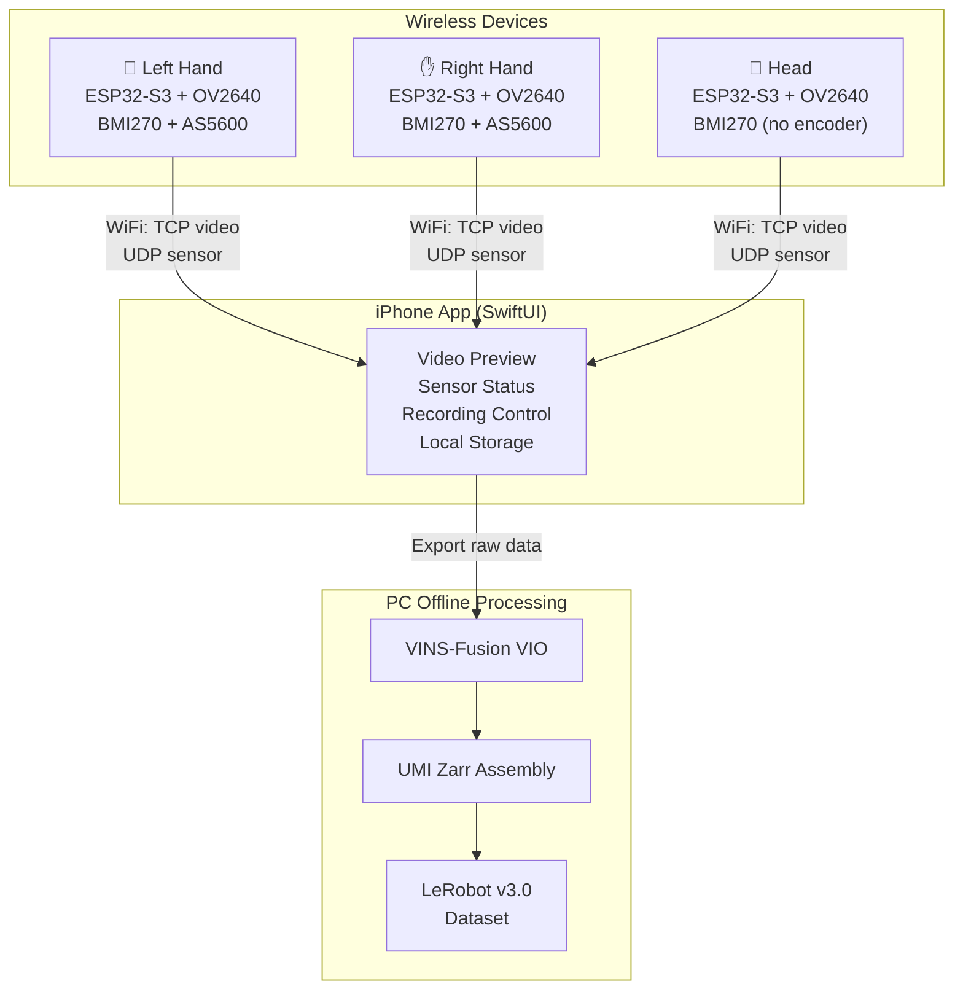
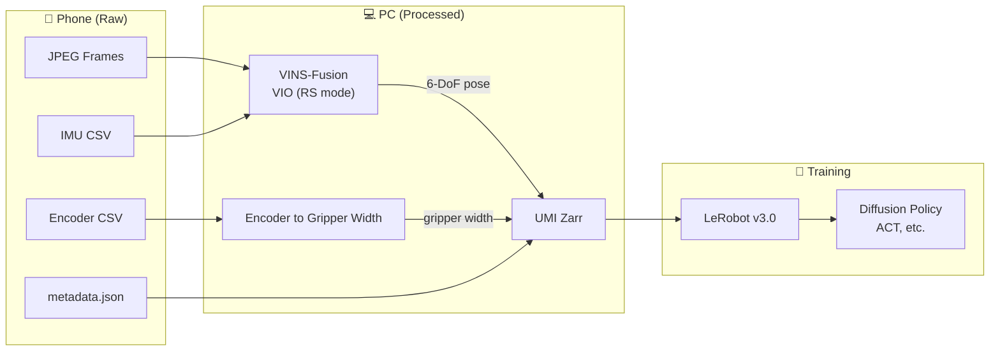

# OpenUMI System Design Overview

**Version:** 1.1  
**Date:** 2026-04-09  
**Status:** Approved for implementation

## Purpose

OpenUMI is a wireless data collection system for robot imitation learning. It captures bimanual human manipulation demonstrations — including hand pose, gripper aperture, egocentric video, and head-mounted video — for training robot control policies that target parallel-jaw grippers.

## Design Goals

- **Portable**: No wires, no external tracking systems, collect demonstrations anywhere
- **Simple mechanics**: 1-DOF scissor gripper per hand, single encoder
- **Sub-millisecond sync**: All sensors and devices time-aligned to <500 us
- **Real-time streaming**: All data streamed to phone over WiFi, no on-device storage
- **Low cost**: Target <$50 per device using commodity components
- **Open source**: Full hardware designs, firmware, and app source code (CC BY-NC-SA 4.0)

## System Composition

| Device | Quantity | Sensors | Role |
|--------|----------|---------|------|
| Hand device (L) | 1 | Camera + IMU + Encoder | Captures left-hand manipulation |
| Hand device (R) | 1 | Camera + IMU + Encoder | Captures right-hand manipulation |
| Head device | 1 | Camera + IMU | Captures third-person view |
| iPhone App | 1 | — | Control, preview, storage |

## Architecture



## Design Documents

| Document | Scope |
|----------|-------|
| [01-mechanical-design.md](01-mechanical-design.md) | Finger device scissor mechanism, head mount, enclosure, 3D printing |
| [02-pcb-design.md](02-pcb-design.md) | Schematic, component selection, PCB layout, JLCPCB manufacturing |
| [03-firmware-design.md](03-firmware-design.md) | ESP-IDF firmware, FreeRTOS tasks, sensor drivers, WiFi streaming |
| [04-ios-app-design.md](04-ios-app-design.md) | SwiftUI app, device discovery, recording control, data storage |
| [05-pc-pipeline-design.md](05-pc-pipeline-design.md) | VINS-Fusion VIO, UMI zarr assembly, LeRobot v3.0 conversion |
| [06-communication-protocol.md](06-communication-protocol.md) | WiFi topology, TCP/UDP packet formats, time synchronization |

## Data Pipeline



## Implementation Roadmap

```mermaid
gantt
    title OpenUMI Development Roadmap
    dateFormat YYYY-MM-DD
    axisFormat %b

    section Design
    Phase 1: System Design & Spec           :done, p1, 2026-04-01, 2026-04-09

    section Software Validation
    Phase 2: Dev Board Prototype            :p2, after p1, 14d
    Phase 3: iOS App Single-Device          :p3, after p2, 14d
    Phase 4: Offline Pipeline (VIO+LeRobot) :p4, after p2, 21d

    section Custom Hardware
    Phase 5: PCB Design & Fabrication       :p5, after p4, 21d
    Phase 6: Mechanical Design & 3D Print   :p6, after p5, 14d

    section Integration
    Phase 7: Single-Device Integration      :p7, after p6, 7d
    Phase 8: Three-Device Joint Validation  :p8, after p7, 14d

    section Ecosystem
    Phase 9: Data Visualization Tools       :p9, after p8, 21d
    Phase 10: Model Training & Deployment   :p10, after p8, 28d
```

| Phase | Goal | Validation Criteria |
|-------|------|-------------------|
| 1 | System design & specification | Design reviewed and approved |
| 2 | Dev board prototype validation | Stable 25fps JPEG + 200Hz IMU streaming over WiFi for 15+ min |
| 3 | iOS app single-device validation | Record 5-min session, data files match spec, export works |
| 4 | Offline data pipeline validation | Valid LeRobot v3.0 dataset loadable for policy training |
| 5 | Custom PCB design & fabrication | Assembled PCB boots, all sensors respond, WiFi connects |
| 6 | Mechanical design & 3D printing | Components fit, finger mechanism moves freely, comfortable |
| 7 | Single-device integration test | No degradation vs dev board; battery lasts 18+ min |
| 8 | Three-device joint validation | Synchronized three-view dataset, timestamps aligned |
| 9 | Data visualization & annotation | Quickly identify and filter bad episodes |
| 10 | Model training & robot deployment | Trained policy achieves reasonable success rate |

## Risk Register

| Risk | Severity | Likelihood | Mitigation |
|------|----------|------------|------------|
| WiFi bandwidth insufficient for 3x JPEG streams at 25fps | High | Medium | Configurable profiles (Safe: 320x240, Hi-Res: 15fps); test in Phase 2 |
| OV2640 rolling shutter degrades VIO during fast motion | Medium | Medium | VINS-Fusion RS model; exposure <5ms with bright lighting; 8-15mm accuracy |
| OV2640 fixed-focus blur at close range (<15cm) | Medium | Medium | Adjustable-focus OV2640 module with manual focus ring |
| iOS background suspension during recording | Medium | High | `isIdleTimerDisabled` + `BGContinuedProcessingTask`; user warned |
| iOS 26.4 hotspot IPv4 regression | Critical | Medium | Monitor Apple fix; test on latest iOS; long-term: ESP-IDF IPv6 |
| ESP32-S3 I2C/WiFi interrupt contention | Medium | Medium | Sensors on Core 1, WiFi on Core 0; separate I2C buses |
| Battery life too short with 110mAh | Medium | Medium | 18-25 min at 270-350mA; consider larger cell if needed |
| LDO brownout during WiFi TX spikes | Medium | Low | AP2112K (600mA); add bulk capacitance |
| TP4056 overcharging small cell | High | Low | PROG = 10kΩ limits to ~100mA (~1C) |
| Multicast entitlement for UDP broadcast | Medium | Low | Request from Apple; dummy packet triggers permission |
| OV2640 zero-sized frame bug | Medium | Low | Pin esp-idf + esp32-camera version; test in Phase 2 |

## AI-Driven Development Toolchain

| Domain | Tool | MCP Server | Manufacturing |
|--------|------|------------|---------------|
| Mechanical | FreeCAD | neka-nat/freecad-mcp | JLCPCB 3D Print |
| PCB | KiCad 8 | mixelpixx/KiCAD-MCP-Server | JLCPCB PCB+SMT |
| Parts | LCSC | Averyy/pcbparts-mcp | JLCPCB/LCSC |
| Firmware | ESP-IDF v5.x | idf.py mcp-server | USB flash |
| iOS App | Xcode / SwiftUI | getsentry/XcodeBuildMCP | TestFlight |
| Offline Processing | Python | Claude Code (direct) | — |

## Future Directions

- **Wi-Fi Aware (iOS 26)**: Direct device-to-device WiFi without hotspot. ESP32-S3 does not support it yet. Track [ESP-IDF #16743](https://github.com/espressif/esp-idf/issues/16743).
- **Real-time VIO on iPhone**: Eliminate offline processing by running VIO on device (ARKit or custom).
- **ESP-IDF IPv6**: Dual-stack networking to future-proof against iOS hotspot IPv4 regressions.

## References

- [UMI: Universal Manipulation Interface](https://umi-gripper.github.io/) — Design inspiration, SLAM pipeline
- [Fast-UMI](https://github.com/zxzm-zak/FastUMI_Data) — Hardware pose tracking variant
- [LeRobot](https://github.com/huggingface/lerobot) — Dataset format v3.0, training framework
- [GELLO](https://wuphilipp.github.io/gello_site/) — Encoder precision reference
- [ALOHA 2](https://aloha-2.github.io/) — Bimanual teleoperation reference
- [ESP-IDF Programming Guide](https://docs.espressif.com/projects/esp-idf/en/stable/esp32s3/)
- [VINS-Fusion](https://github.com/HKUST-Aerial-Robotics/VINS-Fusion) — VIO with rolling shutter support
- [Kalibr](https://github.com/ethz-asl/kalibr) — Camera-IMU calibration
- [Apple TN3179: Local network privacy](https://developer.apple.com/documentation/technotes/tn3179-understanding-local-network-privacy)
- [WWDC25: BGContinuedProcessingTask](https://developer.apple.com/videos/play/wwdc2025/227/)
- [WWDC25: Wi-Fi Aware](https://developer.apple.com/videos/play/wwdc2025/228/)
