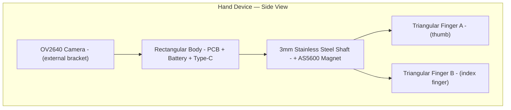

# Mechanical Design

> Part of [OpenUMI System Design](00-system-overview.md)

## Overview

Three device enclosures share a common rectangular body design. Hand devices add a scissor finger mechanism with magnetic encoder. The head device adds strap mounting points.

## Hand Device

### Dimensions

- **Body**: ~34 x 30 x 12 mm (houses PCB 28x32mm + battery 30x12x3mm)
- **Finger pieces**: Triangular thimbles, sized S/M/L for different hands
- **Total weight estimate**: ~20-30g (PCB ~5g, battery ~3g, shell ~5g, camera ~2g, misc ~5g)

### Scissor Mechanism

The two triangular finger pieces are riveted to a single 3mm stainless steel shaft, forming a scissor linkage. When the user opens or closes their fingers, both pieces rotate symmetrically around the shared axis.

**Key design details:**

- **Shaft**: 3mm diameter, 303/316 stainless steel dowel pin, h6 tolerance
- **Bushing**: PTFE bushing (3mm ID, 4mm OD) pressed into body hole for smooth, low-friction rotation
- **Retention**: E-clips (circlips) on both ends of the shaft to prevent axial drift
- **Magnet**: 6mm diameter x 2.5mm thick diametrically magnetized NdFeB disc (N35-N52), glued to one end of the shaft
- **AS5600 alignment**: Magnet centered over AS5600 IC within ±0.25mm. A raised alignment boss on the 3D-printed body ensures centering. Air gap: 1.0-1.5mm between magnet and IC.

### Finger Pieces

- **Shape**: Triangular thimble that wraps around the finger pad, open at the fingertip to allow skin-to-object contact
- **Sizing**: 3 sizes (S/M/L) to accommodate different finger dimensions
- **Inner surface**: Slightly oversized with optional silicone/TPU pad liner for comfort and grip
- **All internal edges filleted** (no sharp corners)

### Camera Mount

- OV2640 module (~8x8mm) on a rigid bracket integrated into the body shell
- **Lens selection**: Wide-angle OV2640 module (120°+ FOV recommended) with adjustable focus ring (minimum focus ~5-10cm for close-range manipulation)
- **Orientation**: Facing forward, tilted 15-30° downward toward workspace (egocentric "wrist camera" perspective)
- Silicone adhesive (RTV) between module and bracket for vibration damping

## Head Device

### Dimensions

- Same rectangular body as hand device (without encoder cutout and finger mounting points)
- **Weight**: ~15-20g (lighter than hand device — no encoder, no finger pieces)

### Head Strap Mounting

- Two parallel slots (20-25mm wide) on the back of the body for elastic band pass-through
- Compatible with standard headlamp-style elastic bands (widely available)
- Non-slip silicone pads on inner surface
- Alternative mounting: clip onto glasses frames or baseball cap brim

### Camera Mount

- Same OV2640 bracket as hand device
- Forward-facing, slight downward tilt (15-30°) for third-person workspace view

## Manufacturing

### Material Selection

| Part | Material | Process | Notes |
|------|----------|---------|-------|
| Body shell | MJF PA12 nylon | JLCPCB 3D printing | Durable, biocompatible, good surface finish |
| Finger pieces | MJF PA12 nylon | JLCPCB 3D printing | Rigid structure, optional TPU pad inserts |
| Camera bracket | MJF PA12 nylon | JLCPCB 3D printing | Integrated into body shell |
| Rotation shaft | 303/316 stainless steel | Purchased (standard dowel pin) | 3mm diameter, h6 tolerance |
| Shaft bushings | PTFE | Purchased (standard tube) | 3mm ID, 4mm OD |
| Shaft retention | E-clips | Purchased (standard) | For 3mm shaft |
| Encoder magnet | NdFeB N35-N52 | Purchased | 6mm dia x 2.5mm, diametrically magnetized |

> SLA resin may be used for early prototyping iterations but is not recommended for production use (brittle, UV-degrades, potential skin irritation).

### Design Tool

- **FreeCAD** with MCP automation (neka-nat/freecad-mcp)
- Export STL files for JLCPCB 3D printing
- Parametric design for easy iteration on dimensions

### Assembly Sequence

1. Press PTFE bushings into body shell shaft holes
2. Insert 3mm shaft through body + both finger pieces
3. Glue diametric magnet to shaft end (align with AS5600 on PCB)
4. Secure shaft with E-clips on both ends
5. Insert PCB assembly into body shell
6. Connect OV2640 FPC cable to PCB
7. Connect battery JST-PH to PCB
8. Close body shell (snap-fit or screws)

## Implementation Plan

**Phase 6** in the overall roadmap. Executed after PCB fabrication (Phase 5) so enclosure dimensions match actual PCB.

| Step | Task | Tool |
|------|------|------|
| 1 | Measure fabricated PCB dimensions precisely | Calipers |
| 2 | Design body shell in FreeCAD (parametric, based on PCB measurements) | FreeCAD + MCP |
| 3 | Design finger pieces (S/M/L sizes) | FreeCAD + MCP |
| 4 | Design head device body variant (no encoder cutout, strap slots) | FreeCAD + MCP |
| 5 | Design camera bracket (integrated into body) | FreeCAD + MCP |
| 6 | Export STL, order from JLCPCB (MJF PA12 nylon) | JLCPCB |
| 7 | Order off-the-shelf parts (shaft, bushings, E-clips, magnets, elastic band) | LCSC / Amazon |
| 8 | Assemble first unit, test fit and finger mechanism | Manual |
| 9 | Iterate design if needed (adjust tolerances, clearances) | FreeCAD + MCP |
