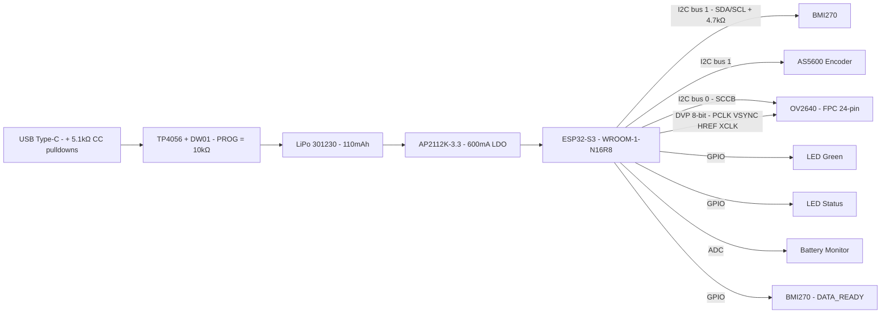

# PCB & Circuit Design

> Part of [OpenUMI System Design](00-system-overview.md)

## Overview

A single universal PCB serves all three devices (left hand, right hand, head). The head device simply leaves the AS5600 encoder unpopulated.

## Board Specifications

| Parameter | Value |
|-----------|-------|
| Dimensions | ~28 x 32 mm |
| Layers | 4 (TOP / GND / POWER / BOTTOM) |
| Passive size | 0402 |
| Manufacturer | JLCPCB standard 4-layer process |
| Estimated cost | ~$8-12 for 5 pcs (PCB only) |

**Why 28x32mm**: ESP32-S3-WROOM-1-N16R8 is 18x25.5mm — at 25x30mm it would consume 61% of the board with no margin. 28x32mm provides room for connectors and back-side components.

**Why 4-layer**: (1) Unbroken GND plane under BMI270 for vibration rejection; (2) Espressif hardware design guidelines recommend 4-layer for WROOM modules; (3) 12+ DVP camera signals require inner-layer routing at this density.

## Component Selection

| Component | Model | Package | Interface | Key Specs |
|-----------|-------|---------|-----------|-----------|
| MCU | ESP32-S3-WROOM-1-N16R8 | Module 18x25.5mm | — | 240MHz dual-core, 16MB Flash, 8MB PSRAM, WiFi + BLE |
| Camera | OV2640 (wide-angle 120°+, adjustable focus) | FPC 24-pin | DVP 8-bit | 640x480 JPEG @ 30fps, built-in ISP |
| IMU | BMI270 | LGA 2.5x3.0mm | I2C (bus 1) | 6-axis, 200Hz, DATA_READY interrupt |
| Encoder | AS5600 | SOIC-8 | I2C (bus 1) | 12-bit, contactless magnetic, 0.088° resolution |
| Charge IC | TP4056 | SOP-8 | — | Li-ion charger, PROG=10kΩ → 100mA charge current |
| LDO | AP2112K-3.3 | SOT-23-5 | — | 600mA max, low dropout |
| USB connector | Type-C mid-mount | ~8.9x7.3mm | USB 2.0 | 5.1kΩ CC pull-downs for 5V sink |
| FPC connector | 24-pin 0.5mm pitch | ~13.5x2.5mm | — | OV2640 camera cable |
| Battery connector | JST-PH 2-pin | ~6x4mm | — | 301230 LiPo (110mAh, 30x12x3mm) |
| Protection | DW01 + FS8205 | SOT-23 + SOT-23-6 | — | Battery over-discharge/short protection |
| LEDs | 0402 LED x 2 | 0402 | GPIO | Green (power/charge), Red/Blue (status) |

### Power Budget

| Consumer | Average Current | Peak Current |
|----------|----------------|-------------|
| ESP32-S3 (WiFi TX active) | 200-250 mA | 350-400 mA |
| OV2640 camera | 40-60 mA | 80 mA |
| BMI270 IMU | ~0.9 mA | ~1.5 mA |
| AS5600 encoder | ~1.5 mA | ~2 mA |
| LEDs | ~5 mA | ~10 mA |
| PSRAM active | 10-20 mA | 20 mA |
| **Total at 3.3V rail** | **270-350 mA** | **~400 mA** |

**Battery runtime**: 110mAh / 300mA ≈ 22 min average. Practical estimate: **18-25 minutes**.

**Why AP2112K over ME6211**: ME6211 is rated 500mA with no headroom for WiFi TX spikes. AP2112K at 600mA provides sufficient margin.

**TP4056 charge current**: PROG resistor = 10kΩ limits charge to ~100mA (1C rate for 110mAh cell). Default TP4056 with 1.2kΩ would charge at 1A (~9C), which is dangerous for this cell size.

## Schematic



### I2C Bus Assignment

| Bus | Devices | Purpose | Pull-ups |
|-----|---------|---------|----------|
| Bus 0 | OV2640 (SCCB) | Camera register config during init only | Internal to OV2640 |
| Bus 1 | BMI270 (addr 0x68) + AS5600 (addr 0x36) | 200Hz sensor reads | 4.7kΩ external |

No address conflict: BMI270 uses 0x68 (SDO→GND), AS5600 fixed at 0x36.

## PCB Layout

### Component Placement

```
        ┌────── 28mm ──────┐
        │                  │
   ┌────┤  ESP32-S3 Module │───── Antenna overhang (3-5mm)
   │    │  (TOP SIDE ONLY) │
   │    │  18 x 25.5 mm    │
32mm    │                  │
   │    ├──FPC 24-pin──────┤  ← OV2640 camera (side edge)
   │    │                  │
   │    │                  │
   └────┤──USB Type-C──────┤  ← Bottom edge
        └──────────────────┘

BOTTOM SIDE:
   BMI270 (center, over GND plane)
   AS5600 (near shaft/magnet position)
   TP4056 + DW01
   AP2112K
   LEDs + resistors
   Decoupling caps (0402)
   Battery JST-PH (side edge)
```

### Layout Rules

- **Antenna keepout**: ESP32-S3 antenna overhangs PCB top edge by 3-5mm into open air. No copper on any layer under antenna footprint.
- **GND plane**: Continuous, unbroken on Layer 2 (GND). Critical under BMI270 for vibration rejection and under ESP32-S3 for WiFi performance.
- **DVP routing**: 12+ signals (D0-D7, PCLK, VSYNC, HREF, XCLK) routed on inner layers from ESP32 to FPC connector. Keep traces short and matched length where possible.
- **Decoupling**: 100nF on every IC VCC pin (0402, placed as close as possible). 10μF bulk cap on LDO output.
- **USB D+/D-**: Short, impedance-matched differential pair from Type-C to ESP32 USB pins.
- **Battery voltage divider**: Two resistors (e.g., 100kΩ + 100kΩ) to bring 4.2V battery to ~2.1V for ESP32 ADC.

## Manufacturing

### JLCPCB Process

| Parameter | Spec |
|-----------|------|
| Min trace width | 0.1mm (4-layer standard) |
| Min trace spacing | 0.1mm |
| Min via drill | 0.2mm |
| Min annular ring | 0.15mm |
| Surface finish | ENIG (recommended for fine-pitch) or HASL |
| Board thickness | 1.6mm |

### Export Deliverables

Generated by kicad-jlcpcb-tools plugin:

1. **Gerber files** (all layers) — ZIP archive
2. **BOM** (JLCPCB format, with LCSC part numbers)
3. **CPL** (component placement list, pick-and-place coordinates)

### Design Tool

- **KiCad 8** with MCP server (mixelpixx/KiCAD-MCP-Server)
- **Parts search**: pcbparts-mcp for real-time LCSC stock and pricing
- **JLCPCB export**: kicad-jlcpcb-tools plugin (1,827 stars, mature)

## Implementation Plan

**Phase 5** in the overall roadmap. Executed after dev board validation (Phases 2-4) confirms the circuit works.

| Step | Task | Tool |
|------|------|------|
| 1 | Create KiCad project, import component symbols/footprints | KiCad + MCP |
| 2 | Draw schematic (ESP32-S3 + BMI270 + AS5600 + TP4056 + AP2112K + OV2640 FPC + USB-C) | KiCad + MCP |
| 3 | Verify schematic with ERC (Electrical Rules Check) | KiCad |
| 4 | Assign LCSC part numbers using pcbparts-mcp | pcbparts MCP |
| 5 | PCB layout: place components (top: ESP32; bottom: all others) | KiCad + MCP |
| 6 | Route traces (4-layer, antenna keepout, DVP on inner layers) | KiCad + MCP |
| 7 | Run DRC (Design Rules Check) against JLCPCB capabilities | KiCad |
| 8 | Export Gerber + BOM + CPL via kicad-jlcpcb-tools | KiCad plugin |
| 9 | Order PCB + SMT assembly from JLCPCB | JLCPCB website |
| 10 | Receive boards, visual inspection, power-on test | Manual |
