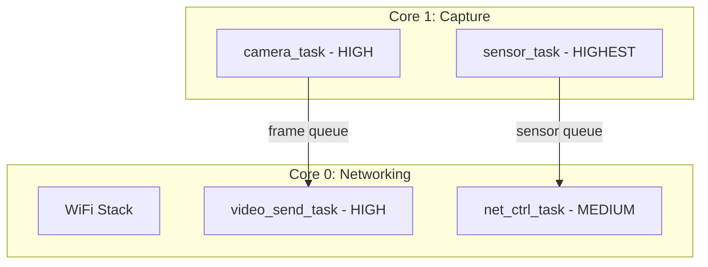
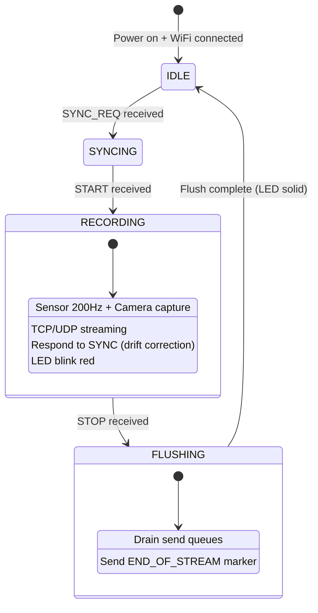
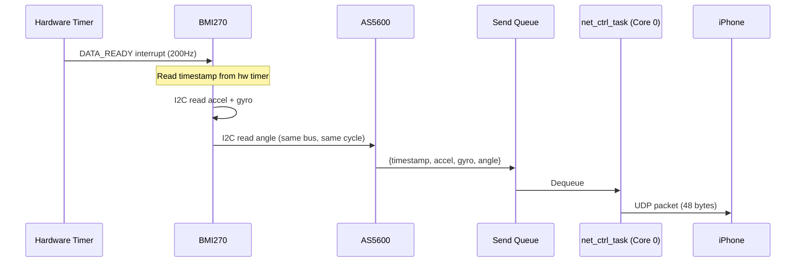

# Firmware Design

> Part of [OpenUMI System Design](00-system-overview.md)

## Overview

A single firmware binary runs on all three devices (left hand, right hand, head). Device role is configured via NVS. The firmware captures sensor data at 200Hz and camera frames at 30fps, streaming everything to the iPhone app over WiFi.

## Framework

| Item | Choice |
|------|--------|
| SDK | ESP-IDF v5.x (official Espressif) |
| RTOS | FreeRTOS (built into ESP-IDF) |
| Language | C |
| Build | CMake + idf.py |
| Camera component | esp32-camera v2.1.6 |
| Dev tool | ESP-IDF built-in MCP (`idf.py mcp-server`) |

## NVS Configuration

```
device_role    = LEFT | RIGHT | HEAD
wifi_ssid      = "<phone hotspot SSID>"
wifi_pass      = "<phone hotspot password>"
device_name    = "openumi-left" | "openumi-right" | "openumi-head"
camera_res     = VGA | QVGA          (640x480 | 320x240, default VGA)
camera_fps     = 25 | 15 | 30        (default 30)
jpeg_quality   = 50-90               (default 70)
```

- HEAD role: skips AS5600 initialization, fills `encoder_angle = 0` in sensor packets
- Camera config can be updated at runtime via App control commands (no reflash needed)
- Initial NVS written via USB serial during first setup

## Task Architecture



**Core 0 tasks:**
- **WiFi Protocol Stack**: System-managed, pinned to Core 0
- **video_send_task** (HIGH): Dequeue JPEG frames, TCP send, frame-drop if buffer full
- **net_ctrl_task** (MEDIUM): UDP sensor send, control command receive, clock sync

**Core 1 tasks:**
- **sensor_task** (HIGHEST): BMI270 + AS5600 via I2C bus 1, hardware timestamp, 200Hz
- **camera_task** (HIGH): DVP frame capture, 2-buffer JPEG management

**Why sensors on Core 1**: WiFi on Core 0 generates frequent high-priority interrupts that cause I2C timing violations and bus errors ([espressif/arduino-esp32#1352](https://github.com/espressif/arduino-esp32/issues/1352)). Isolating sensor reads on Core 1 avoids this.

**Separate I2C buses**: Bus 0 for camera SCCB (init only). Bus 1 for BMI270 + AS5600 (200Hz reads). Prevents contention.

## Critical sdkconfig

```
CONFIG_ESP_WIFI_TASK_CORE_ID=0      # WiFi pinned to Core 0
CONFIG_PM_ENABLE=n                   # Disable DFS (camera incompatible, #799)
CONFIG_SPIRAM_SPEED_80M=y            # PSRAM 80MHz (120MHz has temp sensitivity)
CONFIG_CAMERA_PSRAM_DMA=n            # PSRAM DMA broken for JPEG (#775)
CONFIG_I2C_ISR_IRAM_SAFE=y           # I2C ISR in IRAM for reliability
```

## Camera Configuration

```c
camera_config_t config = {
    .xclk_freq_hz = 20000000,        // 20MHz for OV2640
    .pixel_format = PIXFORMAT_JPEG,
    .frame_size = FRAMESIZE_VGA,      // 640x480
    .jpeg_quality = 12,               // Lower = better quality, bigger frame
    .fb_count = 2,                    // 2 buffers for continuous mode
    .fb_location = CAMERA_FB_IN_PSRAM,
    .grab_mode = CAMERA_GRAB_LATEST,  // Always get latest frame, drop old
};
```

**Key notes**:
- `CAMERA_GRAB_LATEST`: If processing falls behind, the driver returns the most recent frame and discards older ones
- `fb_count = 2`: Minimum for continuous streaming; one being filled by DMA while the other is being sent over WiFi
- `jpeg_quality = 12`: ESP-IDF scale where lower = better quality. Produces ~15-30KB frames at VGA

## Boot Sequence

1. Read NVS configuration (role, WiFi credentials)
2. Initialize hardware:
   - I2C bus 1 → BMI270 + AS5600 (HEAD skips AS5600)
   - I2C bus 0 + DVP → OV2640 camera
   - Hardware timer (microsecond precision)
   - ADC → battery voltage
3. Connect to WiFi hotspot (retry with LED blink)
4. Start UDP heartbeat broadcast every 1 second
5. Wait for phone TCP connection (video channel)
6. Ready → LED solid

## Device State Machine



## Firmware Components

| Component | Description | Interface |
|-----------|-------------|-----------|
| `sensor_driver` | BMI270 + AS5600 on I2C bus 1, timer-notified task (not ISR), retry with bus reset on NAK/timeout | I2C, GPIO |
| `camera_driver` | OV2640 DVP capture, JPEG output, 2-buffer management | DVP |
| `net_manager` | WiFi STA connection, UDP heartbeat broadcast, BLE advertisement, reconnect | WiFi, BLE |
| `data_streamer` | TCP video send (frame-drop if buffer full) + UDP sensor send | Socket |
| `sync_protocol` | Clock sync request/response handler (see [06-communication-protocol.md](06-communication-protocol.md)) | UDP |
| `power_manager` | Battery ADC, charge detection, low-battery alert | ADC, GPIO |
| `config_manager` | NVS read/write, runtime config update from App commands | NVS |
| `led_indicator` | LED status patterns (connecting / ready / recording / low-battery) | GPIO |

## Sensor Data Flow



## Implementation Plan

**Phase 2** in the overall roadmap (dev board prototype).

| Step | Task | Tool |
|------|------|------|
| 1 | Set up ESP-IDF v5.x project, configure sdkconfig | idf.py + MCP |
| 2 | Implement `camera_driver`: OV2640 DVP init, JPEG capture, frame buffer management | ESP-IDF |
| 3 | Implement `sensor_driver`: BMI270 + AS5600 on I2C bus 1, 200Hz timer-notified reads | ESP-IDF |
| 4 | Implement `net_manager`: WiFi STA connection, UDP heartbeat broadcast | ESP-IDF |
| 5 | Implement `data_streamer`: TCP video streaming + UDP sensor streaming | ESP-IDF |
| 6 | Implement `sync_protocol`: clock sync request/response | ESP-IDF |
| 7 | Implement `config_manager`: NVS + runtime config commands | ESP-IDF |
| 8 | Implement `power_manager` + `led_indicator` | ESP-IDF |
| 9 | Integration test on ESP32-S3 dev board + OV2640 + BMI270 breakout + AS5600 breakout | Dev board |
| 10 | Validate: 30fps JPEG + 200Hz IMU over WiFi for 15+ minutes | Measurement |
