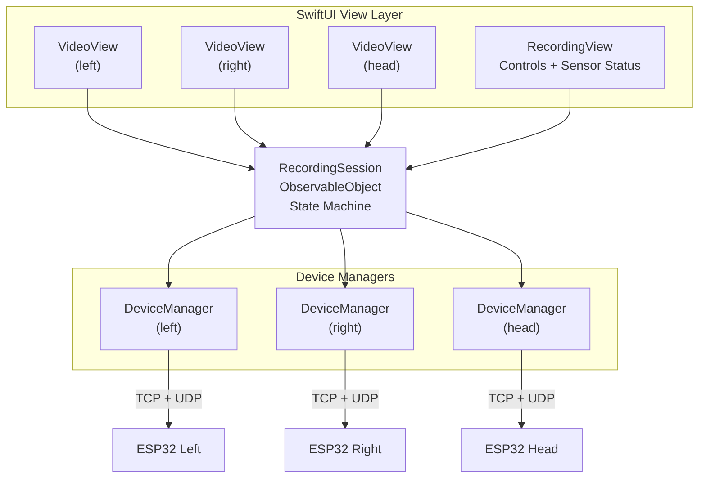

# iOS App Design

> Part of [OpenUMI System Design](00-system-overview.md)

## Overview

A single-page SwiftUI app that discovers OpenUMI devices, provides live video preview, controls recording sessions, and stores all data locally for PC export.

## Technical Stack

| Layer | Technology |
|-------|-----------|
| UI | SwiftUI (iOS 16.0+, built with iOS 26 SDK / Xcode 26) |
| Networking (TCP/UDP) | Network.framework (NWConnection) |
| Networking (broadcast) | BSD sockets (Apple-recommended for UDP broadcast receive) |
| Video preview | UIImage from JPEG data (native) |
| Storage | FileManager + FileHandle (streaming write) |
| Entitlements | `com.apple.developer.networking.multicast` (required for UDP broadcast) |
| Distribution | Xcode direct install / TestFlight |
| Dev tool | Xcode 26 + XcodeBuildMCP + apple-doc-mcp |

## App Architecture



## Modules

| Module | Responsibility |
|--------|---------------|
| `DeviceManager` | UDP heartbeat discovery, BLE fallback, TCP/UDP connections (NWConnection), device lifecycle |
| `VideoPreview` | Receive JPEG frames, display via UIImage on SwiftUI Canvas |
| `SensorReceiver` | Parse UDP sensor packets, update UI bindings |
| `RecordingSession` | State machine: idle → countdown → calibrating → recording → saving → complete |
| `SyncEngine` | NTP-like clock calibration, drift correction every 10s |
| `DataWriter` | Streaming file writes: JPEG frames to camera/ dir, IMU/encoder to CSV, metadata JSON |

## Device Discovery

> mDNS (Bonjour) does not work reliably on iPhone Personal Hotspot (iOS 17+ confirmed broken). UDP broadcast is the primary discovery mechanism.

**Primary: UDP heartbeat**

- Each ESP32 broadcasts a heartbeat packet every 1s to port 19800
- App listens on port 19800 using BSD sockets (not NWConnection — Apple's recommendation for broadcast)
- App collects heartbeats, deduplicates by `device_role`, connects to reported IP

**iOS permissions required:**

1. `com.apple.developer.networking.multicast` entitlement (request from Apple Developer portal)
2. `NSLocalNetworkUsageDescription` in Info.plist
3. On first launch, send a dummy UDP packet to trigger the local network permission dialog

**Fallback: BLE advertisement**

If UDP broadcast fails, each ESP32 advertises a BLE service with its role and IP. App scans BLE, reads IP, connects via WiFi.

## User Flow

1. User enables iPhone Personal Hotspot (preconfigured SSID/password)
2. Power on three devices (auto-connect to hotspot)
3. Open OpenUMI app
4. App discovers devices via UDP heartbeat, shows connection status
5. Three video previews appear automatically
6. User sets recording duration (picker wheel)
7. Tap "Start" → 3-2-1 countdown → clock calibration (~200ms) → recording begins
8. During recording: live preview, sensor readout, countdown timer
9. Timer expires or user taps "Stop" → recording stops
10. Data saved in app Documents directory
11. Export to PC via Finder / Files app

## Screen & Background Execution

iOS 26 tightens background execution enforcement.

- **Screen always-on during recording**: `UIApplication.shared.isIdleTimerDisabled = true` when recording starts, reset on stop
- **Brief background tolerance**: `BGContinuedProcessingTask` (iOS 26+) if user briefly switches away
- **Fallback**: `beginBackgroundTask` (~30s grace for flushing data)
- **UI warning**: "Keep the app in foreground during recording"

> The silent audio background trick is deliberately NOT used. Apple is actively cracking down on this pattern in iOS 26.

## Data Storage

Format aligned with UMI/Fast-UMI conventions for easy LeRobot conversion.

```
Documents/
└── openumi_data/
    └── session_YYYYMMDD_HHMMSS/
        ├── metadata.json
        ├── left_hand/
        │   ├── camera/            # frame_000000.jpg, frame_000001.jpg, ...
        │   ├── timestamps.csv     # frame_index, timestamp_us, timestamp_s
        │   ├── imu.csv            # timestamp_us, accel_xyz, gyro_xyz
        │   └── encoder.csv        # timestamp_us, angle_rad
        ├── right_hand/
        │   └── ...                # Same structure
        └── head/
            ├── camera/
            ├── timestamps.csv
            └── imu.csv            # No encoder.csv
```

### CSV Formats

**timestamps.csv** (one row per video frame):
```csv
frame_index,timestamp_us,timestamp_s
0,1712678432000000,0.000
1,1712678432040000,0.040
```

**imu.csv** (200Hz):
```csv
timestamp_us,accel_x,accel_y,accel_z,gyro_x,gyro_y,gyro_z
1712678432000000,0.12,-9.78,0.34,0.001,-0.002,0.001
```

**encoder.csv** (200Hz, hand devices only):
```csv
timestamp_us,angle_rad
1712678432000000,0.45
```

### metadata.json

```json
{
  "session_id": "20260409_143052",
  "start_time_utc": "2026-04-09T14:30:52Z",
  "end_time_utc": "2026-04-09T14:35:52Z",
  "fps": 25,
  "camera_resolution": [640, 480],
  "jpeg_quality": 70,
  "imu_sample_rate_hz": 200,
  "devices": ["left_hand", "right_hand", "head"],
  "clock_offsets_us": {
    "left_hand": 125.3,
    "right_hand": -89.7,
    "head": 42.1
  },
  "encoder_zero_offset_rad": {
    "left_hand": 0.15,
    "right_hand": 0.12
  },
  "camera_intrinsics": {
    "left_hand": {"fx": 320.0, "fy": 320.0, "cx": 320.0, "cy": 240.0, "dist": [0,0,0,0,0]},
    "right_hand": {"fx": 320.0, "fy": 320.0, "cx": 320.0, "cy": 240.0, "dist": [0,0,0,0,0]},
    "head": {"fx": 320.0, "fy": 320.0, "cx": 320.0, "cy": 240.0, "dist": [0,0,0,0,0]}
  },
  "task_description": "pick up the cup",
  "firmware_version": "0.1.0",
  "app_version": "0.1.0"
}
```

## File Sharing

Info.plist:
- `UIFileSharingEnabled = YES`
- `LSSupportsOpeningDocumentsInPlace = YES`

Users access session data via Finder (macOS) or Files app (iOS).

## Implementation Plan

**Phase 3** in the overall roadmap.

| Step | Task | Tool |
|------|------|------|
| 1 | Create Xcode project (SwiftUI, iOS 16.0+ target, built with iOS 26 SDK) | Xcode 26 + MCP |
| 2 | Implement `DeviceManager`: UDP heartbeat listener (BSD sockets) + NWConnection TCP/UDP | Xcode |
| 3 | Implement `VideoPreview`: receive JPEG over TCP, display with UIImage | Xcode |
| 4 | Implement `SensorReceiver`: parse UDP sensor packets, update @Published bindings | Xcode |
| 5 | Implement `RecordingSession`: state machine + timer + countdown UI | Xcode |
| 6 | Implement `SyncEngine`: NTP-like clock calibration protocol | Xcode |
| 7 | Implement `DataWriter`: streaming JPEG + CSV + metadata.json writes | Xcode |
| 8 | Request `com.apple.developer.networking.multicast` entitlement from Apple | Apple Developer |
| 9 | Test with one ESP32-S3 dev board: discovery → preview → record → export | iPhone + dev board |
| 10 | Validate: 5-min session recorded, files match spec, Finder export works | Manual |
