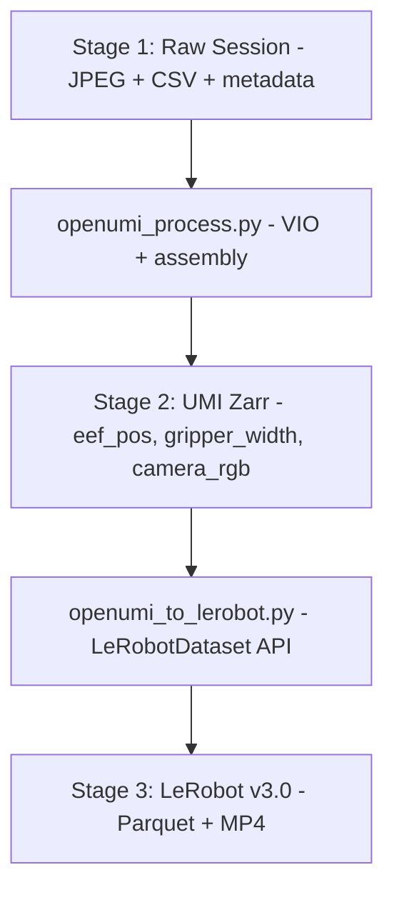

# PC Offline Pipeline Design

> Part of [OpenUMI System Design](00-system-overview.md)

## Overview

The PC pipeline converts raw session data (JPEG frames + IMU CSV + encoder CSV) into a LeRobot v3.0 dataset via an intermediate UMI-compatible zarr. This is where 6-DoF hand poses are recovered using visual-inertial odometry.

## Three-Stage Pipeline



## Processing Steps

### Stage 1 → Stage 2: `openumi_process.py`

| Step | Input | Output | Description |
|------|-------|--------|-------------|
| 1 | timestamps.csv + metadata.json | Aligned timestamps | Apply clock offsets per device, convert to seconds from episode start |
| 2 | camera/*.jpg + imu.csv (per hand) | camera_trajectory.csv | VINS-Fusion visual-inertial odometry (rolling shutter mode) → 6-DoF camera poses |
| 3 | camera_trajectory.csv + calibration | eef_pos + eef_rot | Hand-eye calibration: camera pose → TCP (tool center point) pose |
| 4 | encoder.csv + mechanical params | gripper_width (meters) | Encoder angle → gripper width via mechanical geometry |
| 5 | All above | session_xxx.zarr | Resample all streams to video framerate (30fps), assemble UMI zarr |

**Step 2 detail — VINS-Fusion VIO:**

- Runs in visual-inertial mode (mono camera + IMU)
- **Rolling shutter model enabled**: critical for OV2640 (~16-32ms readout time at VGA)
- Input: JPEG image sequence + IMU CSV in EuRoC-compatible format
- Output: timestamped 6-DoF camera poses (position + orientation)
- IMU integration provides metric scale (absolute meters)
- Online bias estimation and temporal calibration
- Expected accuracy: **8-15mm position** (with bright lighting and short exposure)

**Step 3 detail — Hand-eye calibration:**

- The rigid-body transform from camera frame to tool center point (TCP) is determined by:
  - Translation: measured from PCB layout (camera lens center to device grip point)
  - Rotation: determined by camera and IMU mounting orientation on PCB
- Calibrated using Kalibr (`kalibr_calibrate_imu_camera`) with an AprilGrid target
- This calibration is done once per device and stored in metadata

### Stage 2 → Stage 3: `openumi_to_lerobot.py`

> The legacy `umi_zarr_format.py` has been removed from the lerobot repo. Conversion uses the `LeRobotDataset` public API directly.

```python
from lerobot.common.datasets.lerobot_dataset import LeRobotDataset

dataset = LeRobotDataset.create(repo_id="user/openumi-task", fps=25, features=OPENUMI_FEATURES)

for episode in zarr_episodes:
    for frame in episode:
        dataset.add_frame({
            "observation.state": state_14d,
            "observation.images.left_wrist": left_img,
            "observation.images.right_wrist": right_img,
            "observation.images.head": head_img,
            "action": next_state_14d,
            "task": task_description,
        })
    dataset.save_episode()

dataset.consolidate()
dataset.push_to_hub()
```

## LeRobot Feature Mapping

```json
{
  "codebase_version": "v3.0",
  "robot_type": "openumi",
  "fps": 30,
  "features": {
    "observation.state": {
      "dtype": "float32",
      "shape": [14],
      "names": {
        "motors": [
          "left_x", "left_y", "left_z",
          "left_rx", "left_ry", "left_rz",
          "left_gripper",
          "right_x", "right_y", "right_z",
          "right_rx", "right_ry", "right_rz",
          "right_gripper"
        ]
      }
    },
    "observation.images.left_wrist": { "dtype": "video", "shape": [480, 640, 3] },
    "observation.images.right_wrist": { "dtype": "video", "shape": [480, 640, 3] },
    "observation.images.head": { "dtype": "video", "shape": [480, 640, 3] },
    "action": {
      "dtype": "float32",
      "shape": [14],
      "names": { "motors": ["...same as observation.state..."] }
    }
  }
}
```

**observation.state** = `[left_pos(3) + left_rot_axis_angle(3) + left_gripper_width(1) + right_pos(3) + right_rot_axis_angle(3) + right_gripper_width(1)]` = 14D

**action** = `observation.state[t+1]` (next-state-as-action, standard in UMI/Diffusion Policy)

## VIO Operational Recommendations

- **Bright, consistent lighting**: Allows short exposure times (<5ms), reducing motion blur
- **Camera calibration**: Use Kalibr with AprilGrid target; include temporal offset estimation
- **Lens**: Wide-angle OV2640 (120°+) with Kannala-Brandt fisheye model in VINS-Fusion config
- **Focus**: Adjustable-focus OV2640 module, set to ~15-25cm working distance
- **Alternative VIO**: OpenVINS (MSCKF-based, also supports rolling shutter, lighter weight)

## Tools & Dependencies

| Tool | Version | Purpose |
|------|---------|---------|
| Python | 3.10+ | All processing scripts |
| VINS-Fusion | latest | Visual-inertial odometry (rolling shutter mode) |
| OpenCV | 4.x | JPEG decoding, calibration |
| NumPy / Pandas | latest | Data manipulation |
| zarr | latest | Intermediate UMI format |
| lerobot | >= 0.4.0 | LeRobotDataset API, push_to_hub |
| ffmpeg | latest | JPEG → MP4 transcoding (called by lerobot internally) |
| Kalibr | latest | Camera-IMU calibration (one-time) |

## Implementation Plan

**Phase 4** in the overall roadmap.

| Step | Task | Tool |
|------|------|------|
| 1 | Set up Python environment (venv, install deps) | pip |
| 2 | Perform camera intrinsic calibration (AprilGrid + OpenCV/Kalibr) | Kalibr |
| 3 | Perform camera-IMU extrinsic calibration (Kalibr) | Kalibr |
| 4 | Implement `openumi_process.py` Step 1: timestamp alignment | Python |
| 5 | Implement Step 2: VINS-Fusion wrapper (convert CSV to EuRoC format, run VIO, parse output) | Python + VINS-Fusion |
| 6 | Implement Step 3: hand-eye transform application | Python |
| 7 | Implement Step 4: encoder angle → gripper width mapping | Python |
| 8 | Implement Step 5: resample + zarr assembly | Python + zarr |
| 9 | Implement `openumi_to_lerobot.py`: zarr → LeRobot v3.0 | Python + lerobot |
| 10 | Validate: load dataset with lerobot, verify structure, test push_to_hub | Python |
