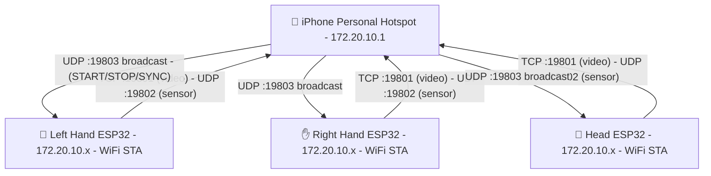
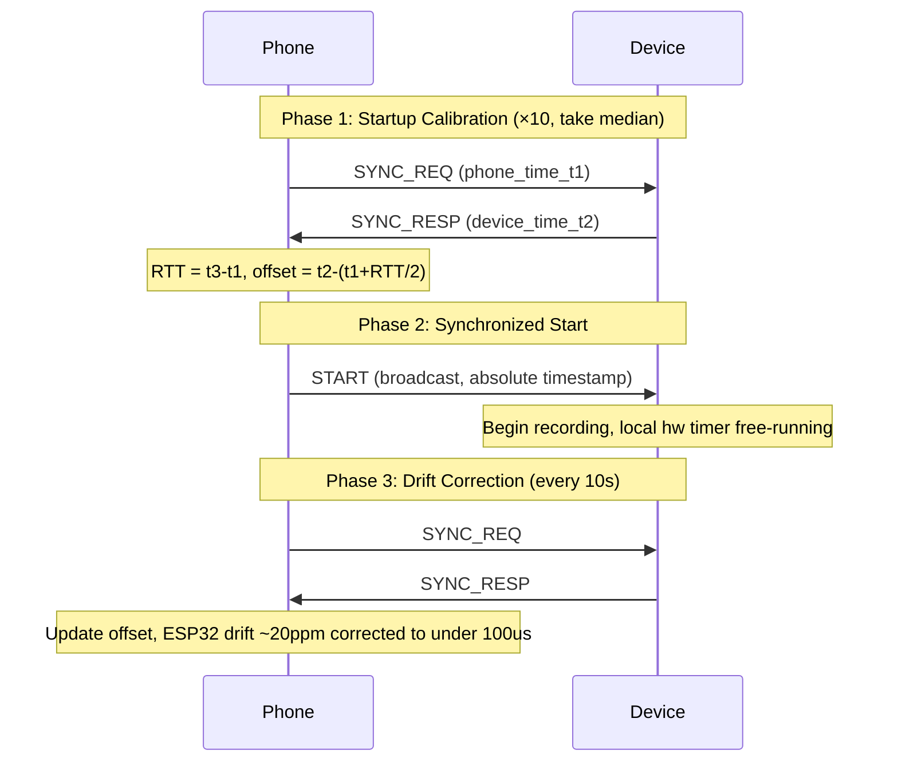

# Communication Protocol Design

> Part of [OpenUMI System Design](00-system-overview.md)

## Overview

Three ESP32-S3 devices communicate with an iPhone app over WiFi (iPhone Personal Hotspot). The protocol covers device discovery, video streaming, sensor data, control commands, and time synchronization.

## Network Topology

## Port Assignment

| Port | Protocol | Direction | Purpose |
|------|----------|-----------|---------|
| 19800 | UDP broadcast | Device → Phone | Device heartbeat / discovery |
| 19801 | TCP | Device → Phone | JPEG video stream (one connection per device) |
| 19802 | UDP | Device → Phone | Sensor data (IMU + encoder, 200Hz) |
| 19803 | UDP broadcast | Phone → Devices | Control commands (START/STOP/SYNC) |

## Device Discovery

### Primary: UDP Heartbeat Broadcast

Each ESP32 broadcasts a heartbeat packet every 1 second to the subnet broadcast address on port 19800.

**Heartbeat packet (32 bytes):**

| Field | Size | Type | Description |
|-------|------|------|-------------|
| magic | 4 bytes | uint32 | `0x554D4948` ("UMIH") |
| device_role | 1 byte | uint8 | 0=left, 1=right, 2=head |
| firmware_ver | 3 bytes | uint8[3] | Major.minor.patch |
| device_ip | 4 bytes | uint32 | Device IPv4 address |
| device_name | 16 bytes | char[16] | Null-terminated (e.g., "openumi-left") |
| reserved | 4 bytes | — | Reserved |

The app collects heartbeats, deduplicates by `device_role`, and establishes TCP/UDP connections to reported IP addresses.

### Fallback: BLE Advertisement

If UDP broadcast fails, each ESP32 advertises a BLE service with its role and IP address. The app scans BLE, reads device IPs, connects via WiFi. BLE is only used for discovery, not data transfer.

### iOS Permissions

- `com.apple.developer.networking.multicast` entitlement (request from Apple Developer portal)
- `NSLocalNetworkUsageDescription` in Info.plist
- Send a dummy UDP packet on first launch to trigger local network permission dialog
- Use BSD sockets for UDP broadcast receive (Apple's recommendation)

## Video Channel: TCP (port 19801)

One TCP connection per device. Carries JPEG frames with timestamps.

**Frame format (variable length):**

| Field | Size | Type | Description |
|-------|------|------|-------------|
| magic | 4 bytes | uint32 | `0x554D4956` ("UMIV") |
| frame_len | 4 bytes | uint32 | Length of JPEG data |
| timestamp | 8 bytes | uint64 | Device hardware timer, microseconds |
| frame_seq | 4 bytes | uint32 | Frame sequence number |
| reserved | 4 bytes | — | Reserved |
| jpeg_data | frame_len bytes | bytes | JPEG frame data |

**Why TCP**: Video frames cannot be dropped — missing frames break VIO trajectory and create gaps in the dataset. TCP guarantees delivery. If TCP send buffer is full, the firmware drops the *oldest* frame and sends the latest (frame-drop policy).

## Sensor Channel: UDP (port 19802)

All three devices send to the phone's UDP port 19802. Differentiated by `device_id`.

**Packet format (48 bytes, fixed):**

| Field | Size | Type | Description |
|-------|------|------|-------------|
| magic | 4 bytes | uint32 | `0x554D4953` ("UMIS") |
| device_id | 1 byte | uint8 | 0=left, 1=right, 2=head |
| seq_num | 3 bytes | uint24 | Sequence number (loss detection) |
| timestamp | 8 bytes | uint64 | Device hardware timer, microseconds |
| accel_x | 4 bytes | float32 | Accelerometer X (m/s²) |
| accel_y | 4 bytes | float32 | Accelerometer Y (m/s²) |
| accel_z | 4 bytes | float32 | Accelerometer Z (m/s²) |
| gyro_x | 4 bytes | float32 | Gyroscope X (rad/s) |
| gyro_y | 4 bytes | float32 | Gyroscope Y (rad/s) |
| gyro_z | 4 bytes | float32 | Gyroscope Z (rad/s) |
| encoder_angle | 4 bytes | float32 | Gripper angle (rad), 0 for head |
| battery_pct | 1 byte | uint8 | Battery percentage |
| status_flags | 1 byte | uint8 | bit0=recording, bit1=low_battery, bit2=sync_locked |
| reserved | 2 bytes | — | Reserved |

**Why UDP**: Sensor data at 200Hz tolerates occasional packet loss (interpolation fills gaps). UDP avoids head-of-line blocking.

**Bandwidth**: 48 bytes × 200Hz × 3 devices = 28,800 bytes/s ≈ 230 Kbps (negligible).

## Control Channel: UDP (port 19803)

Phone → devices broadcast. Devices → phone unicast responses.

**Packet format (16 bytes, fixed):**

| Field | Size | Type | Description |
|-------|------|------|-------------|
| magic | 4 bytes | uint32 | `0x554D4943` ("UMIC") |
| cmd_type | 1 byte | uint8 | Command type |
| device_id | 1 byte | uint8 | Source device (for responses) |
| reserved | 2 bytes | — | Reserved |
| timestamp | 8 bytes | uint64 | Sender's hardware timer, microseconds |

**Command types:**

| Code | Name | Direction | Description |
|------|------|-----------|-------------|
| 0x01 | SYNC_REQ | Phone → Device | Clock sync request |
| 0x02 | SYNC_RESP | Device → Phone | Clock sync response |
| 0x03 | START | Phone → Device (broadcast) | Begin recording |
| 0x04 | STOP | Phone → Device (broadcast) | Stop recording |
| 0x05 | HEARTBEAT | Device → Phone | Device alive + status |

## Time Synchronization

Three-phase protocol achieving <500 μs accuracy across all devices.

## Intra-Device Sensor Synchronization

Within each ESP32, all sensors share a single hardware timer:

1. BMI270 DATA_READY fires GPIO notification at 200Hz
2. Sensor task reads hardware timer → `timestamp`
3. Read BMI270 via I2C bus 1 → accel + gyro
4. Immediately read AS5600 via I2C bus 1 → encoder angle
5. Package {timestamp, accel, gyro, encoder} as one sensor sample

IMU and encoder are strictly synchronized (read in the same task cycle).

Video frames are timestamped when DVP VSYNC fires, correlated with nearest sensor timestamp during offline processing.
