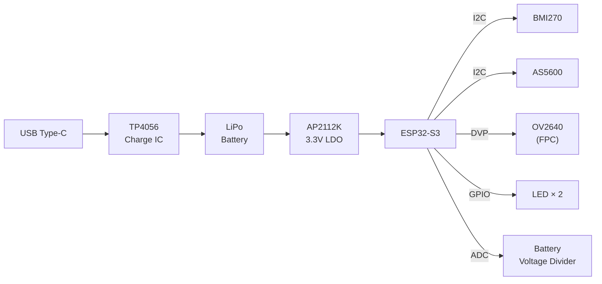
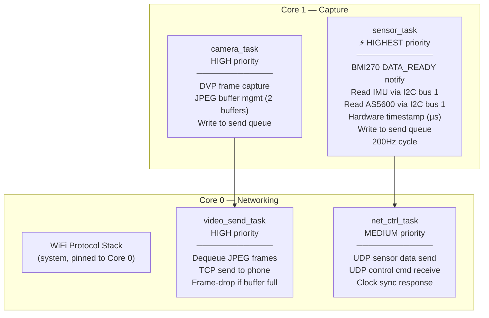
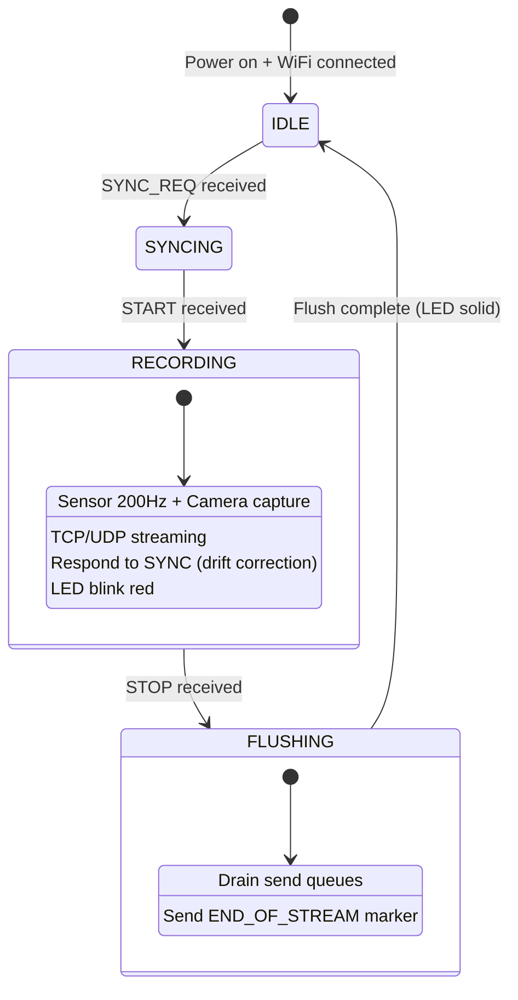
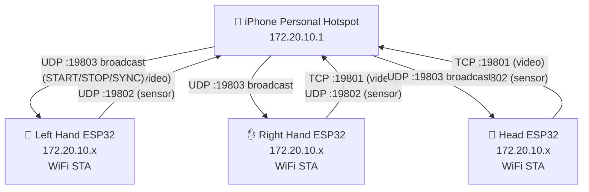
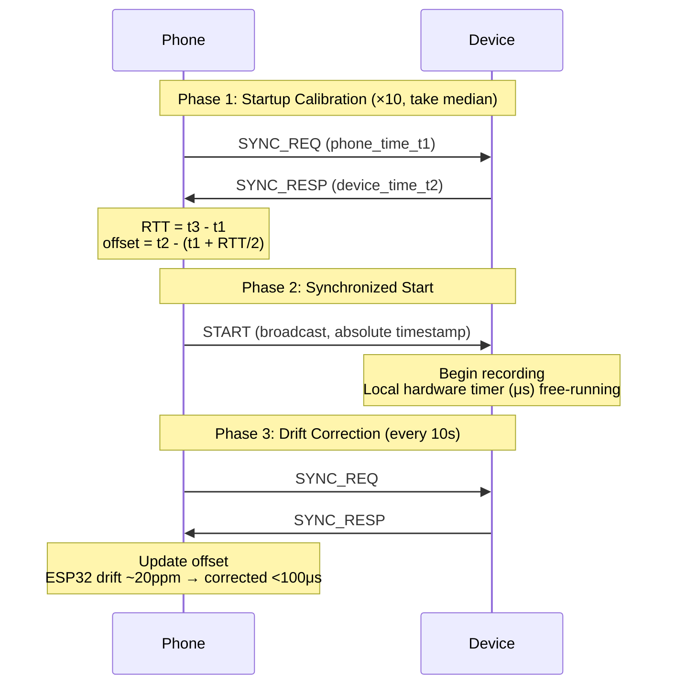
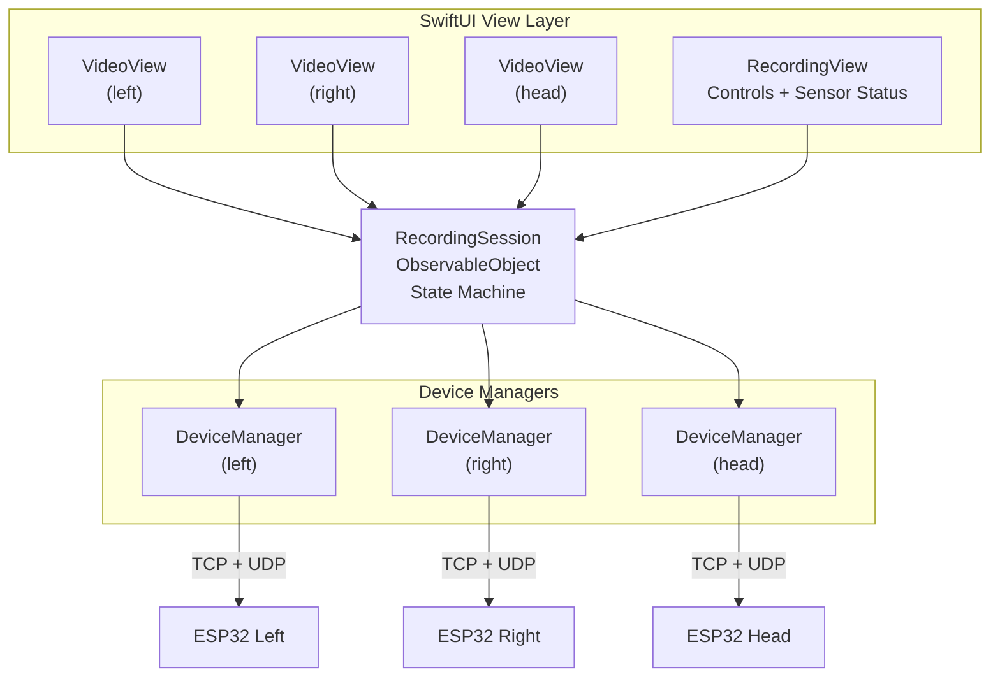
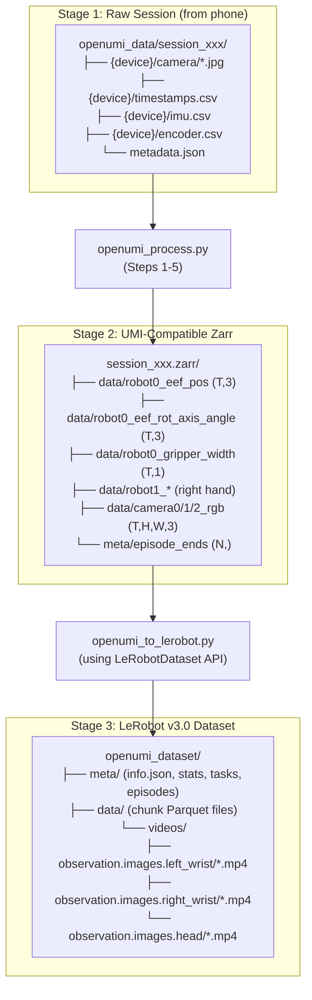

# OpenUMI System Design Specification

**Version:** 1.0  
**Date:** 2026-04-09  
**Status:** Approved for implementation

## 1. Overview

### 1.1 Purpose

OpenUMI is a wireless data collection system for robot imitation learning. It captures bimanual human manipulation demonstrations — including hand pose, gripper aperture, egocentric video, and head-mounted video — for training robot control policies that target parallel-jaw grippers.

### 1.2 Design Goals

- **Portable**: No wires, no external tracking systems, collect demonstrations anywhere
- **Simple mechanics**: 1-DOF scissor gripper per hand, single encoder
- **Sub-millisecond sync**: All sensors and devices time-aligned to <500 us
- **Real-time streaming**: All data streamed to phone over WiFi, no on-device storage
- **Low cost**: Target <$50 per device using commodity components
- **Open source**: Full hardware designs, firmware, and app source code (CC BY-NC-SA 4.0)

### 1.3 System Composition

| Device | Quantity | Sensors | Role |
|--------|----------|---------|------|
| Hand device (L) | 1 | Camera + IMU + Encoder | Captures left-hand manipulation |
| Hand device (R) | 1 | Camera + IMU + Encoder | Captures right-hand manipulation |
| Head device | 1 | Camera + IMU | Captures third-person view |
| iPhone App | 1 | — | Control, preview, storage |

---

## 2. Hardware Design

### 2.1 Component Selection

#### 2.1.1 MCU: ESP32-S3-WROOM-1-N16R8

- Dual-core Xtensa LX7 @ 240MHz
- 16MB Flash + 8MB PSRAM
- WiFi 802.11 b/g/n (2.4GHz)
- BLE 5.0
- DVP camera interface (native)
- I2C, SPI, UART peripherals
- Module size: 18 x 25.5 mm

**Why this variant**: The N16R8 variant provides 8MB PSRAM, essential for buffering JPEG frames during WiFi transmission. The DVP interface natively supports the OV2640 camera without USB Host complications.

#### 2.1.2 Camera: OV2640

- 2MP CMOS sensor
- Built-in JPEG encoder (ISP on-chip)
- DVP parallel interface (8-bit data + PCLK + VSYNC + HREF)
- Default output: 640x480 JPEG @ 25fps (configurable, max ~30fps in ideal conditions)
- Supported configurations: 640x480 or 320x240, 15/25/30 fps, JPEG quality 50-90
- Typical JPEG frame size: 15-30 KB at quality 70 (640x480)
- Note: 30fps is the OV2640 hardware upper limit at VGA; with concurrent WiFi TX, sustainable rate is 20-25fps
- Module size: ~8 x 8 mm (with lens)
- FPC 24-pin connector

**Why OV2640 over USB UVC H.264**: ESP32-S3 only supports USB Full Speed (12 Mbps), and the USB Host UVC driver only supports MJPEG format — H.264 UVC is not feasible on S3. OV2640 via DVP has mature ESP-IDF driver support and is the standard camera for ESP32-S3 projects.

**Bandwidth analysis (default 25fps, 640x480)**:
- Per frame: 15-30 KB JPEG
- Per device: 3.0-6.0 Mbps
- Three devices total: 9.0-18.0 Mbps
- iPhone hotspot throughput (2.4GHz): ~12-18 Mbps practical with 3 clients (collision overhead ~20-30%)
- Margin: adequate at default; fallback profiles for congested RF environments

**Configurable profiles** (set via App before recording):

| Profile | Resolution | FPS | JPEG Quality | Per-Device BW | 3-Device BW | Stability |
|---------|-----------|-----|-------------|---------------|-------------|-----------|
| Default | 640x480 | 25 | 70 | ~4.5 Mbps | ~13.5 Mbps | Good in clean WiFi |
| Max | 640x480 | 30 | 70 | ~5.4 Mbps | ~16.2 Mbps | Ideal conditions only |
| Safe | 320x240 | 25 | 70 | ~1.6 Mbps | ~4.8 Mbps | Very stable |
| Hi-Res | 640x480 | 15 | 80 | ~3.0 Mbps | ~9.0 Mbps | Very stable |

#### 2.1.3 IMU: BMI270

- 6-axis (3-axis accelerometer + 3-axis gyroscope)
- Max sample rate: 1600Hz (accel) / 6400Hz (gyro)
- Operating sample rate: 200Hz
- Interface: I2C (up to 1MHz) or SPI
- Package: LGA 2.5 x 3.0 x 0.83 mm
- Power consumption: ~0.9 mA
- DATA_READY interrupt pin for precise timing

**Why BMI270**: Low power, high accuracy, widely used in VIO pipelines. The DATA_READY interrupt enables precise timestamping at the hardware level.

#### 2.1.4 Encoder: AS5600

- 12-bit contactless magnetic rotary encoder
- Resolution: 0.088 degrees (4096 positions/revolution)
- Interface: I2C (same bus as BMI270)
- Package: SOIC-8
- Requires diametrically magnetized magnet on rotation axis
- No mechanical wear

**Why AS5600**: Compact, contactless, proven in robotics teleoperation (similar precision level to GELLO). I2C interface allows sharing a bus with BMI270 for synchronized reads.

#### 2.1.5 Power

- **Battery**: 301230 LiPo, ~110mAh, 30 x 12 x 3 mm
- **Charge IC**: TP4056 with DW01 protection, PROG resistor = 10kΩ (limits charge current to ~100mA for 110mAh cell safety, ~1C rate)
- **Charging**: USB Type-C connector with 5.1kΩ CC pull-downs (shared with firmware flashing)
- **LDO**: AP2112K-3.3 (600mA max output, low dropout, SOT-23-5 package)
- **Runtime estimate**: ~18-25 minutes at ~270-350mA average draw at 3.3V rail (WiFi + camera + sensors); peaks to ~400mA during WiFi TX bursts
- **Connector**: 2-pin JST-PH for battery

**Why AP2112K over ME6211**: ESP32-S3 peak current during WiFi TX bursts can reach 350-450mA (MCU + camera + sensors). ME6211 is rated 500mA with no headroom; AP2112K at 600mA provides sufficient margin to avoid brownout during transient spikes.

#### 2.1.6 Indicators

- LED 1 (green): Power / charging status
- LED 2 (red/blue): Device status (connecting / ready / recording)

### 2.2 Mechanical Structure

#### 2.2.1 Hand Device

The hand device consists of:

1. **Rectangular body** (~34 x 30 x 12 mm): Houses PCB (28x32mm) + battery, Type-C port
2. **Two triangular finger pieces**: Worn on thumb and index finger
3. **Shared rotation axis**: Single shaft connecting both finger pieces to the body via a hinge
4. **AS5600 + magnet**: Encoder at one end of the shaft, diametric magnet fixed to the shaft

**Scissor mechanism**: The two finger pieces are riveted to the same axis, forming a scissor-like linkage. When the user opens or closes their fingers, both pieces rotate symmetrically. The AS5600 reads the angular displacement, which maps to parallel-jaw gripper aperture.

**Camera mount**: OV2640 module attached externally on the body via a small bracket, facing forward (egocentric view).

#### 2.2.2 Head Device

- Same rectangular body (without encoder cutout)
- Head strap mounting points (two slots for elastic band)
- Camera module on front-facing bracket
- No encoder, no finger pieces

#### 2.2.3 Manufacturing

- **Body and finger pieces**: JLCPCB 3D printing (SLA resin or MJF nylon)
- **Rotation axis**: Metal pin (stainless steel, press-fit)
- **Design tool**: FreeCAD with MCP automation

### 2.3 PCB Design

#### 2.3.1 Board Specifications

- **Dimensions**: ~28 x 32 mm (4-layer required)
- **Layer stack**: TOP (signal + components) / GND / POWER / BOTTOM (signal + components)
- **Universal design**: Same PCB for all three devices; AS5600 left unpopulated for head device
- **Antenna**: ESP32-S3 module antenna end overhangs PCB top edge by ~3-5mm (eliminates keepout area on PCB)
- **Passive components**: 0402 size (JLCPCB standard assembly)
- **Manufacturer**: JLCPCB standard 4-layer process (~$8-12 for 5 pcs)

**Why 28x32mm**: The ESP32-S3-WROOM-1-N16R8 module alone is 18x25.5mm (would occupy 61% of a 25x30mm board). At 28x32mm, there is sufficient room for the USB-C connector on the bottom edge, FPC camera connector on a side edge, and all ICs/passives on the back side.

**Why 4-layer**: (1) Unbroken GND plane under BMI270 for vibration rejection; (2) ESP-IDF hardware design guidelines recommend 4-layer for WROOM modules; (3) 12+ DVP camera signals need inner-layer routing at this density.

#### 2.3.2 Key Layout Considerations

- **Top side**: ESP32-S3 module only, antenna overhanging top edge into open air
- **Bottom side**: BMI270 (center, over solid GND plane), AS5600, TP4056, AP2112K, LEDs, passives
- **Bottom edge**: USB Type-C mid-mount connector (cable access, closest to ESP32 USB pins)
- **Side edge**: OV2640 FPC 24-pin connector (13.5mm wide, along 32mm edge, near DVP pin cluster)
- **I2C bus 0**: Camera SCCB only (OV2640 register access during init)
- **I2C bus 1**: BMI270 + AS5600 on shared SDA/SCL with 4.7kΩ pull-ups (high-frequency sensor reads)
- Battery JST-PH connector on side edge
- Two LED footprints with current-limiting resistors
- No debug header (USB serial used for flashing and debug to save space)

#### 2.3.3 Schematic Blocks



#### 2.3.4 Design Tool

- **KiCad** with MCP server (mixelpixx/KiCAD-MCP-Server)
- **Parts sourcing**: pcbparts-mcp for LCSC availability
- **Manufacturing export**: kicad-jlcpcb-tools plugin (Gerber + BOM + CPL)

---

## 3. Firmware Design

### 3.1 Framework

- **SDK**: ESP-IDF v5.x (official Espressif SDK)
- **RTOS**: FreeRTOS (built into ESP-IDF)
- **Language**: C
- **Build**: CMake + idf.py
- **Development tool**: ESP-IDF built-in MCP server (`idf.py mcp-server`)

### 3.2 Single Firmware, Multi-Role

All three devices run the same firmware binary. Role is configured via NVS (Non-Volatile Storage):

```
NVS Configuration:
  device_role    = LEFT | RIGHT | HEAD
  wifi_ssid      = "<phone hotspot SSID>"
  wifi_pass       = "<phone hotspot password>"
  device_name    = "openumi-left" | "openumi-right" | "openumi-head"
  camera_res     = VGA | QVGA          (640x480 | 320x240, default VGA)
  camera_fps     = 25 | 15 | 30        (default 25)
  jpeg_quality   = 50-90               (default 70)
```

HEAD role skips AS5600 initialization and fills `encoder_angle = 0` in sensor packets.

Camera configuration can be updated at runtime via App control commands (no reflash needed). NVS stores defaults used on boot before App connects.

Initial NVS configuration is written via USB serial during first setup.

### 3.3 Task Architecture (FreeRTOS)



> **Why sensors on Core 1 (not Core 0)**: WiFi protocol stack on Core 0 generates frequent high-priority interrupts that can cause I2C timing violations and bus errors. This is a [well-documented issue](https://github.com/espressif/arduino-esp32/issues/1352) across all ESP32 variants. Pinning sensor I2C reads to Core 1 avoids this contention.

> **Separate I2C buses**: Camera SCCB (OV2640 register config) uses I2C bus 0. BMI270 + AS5600 use I2C bus 1. This prevents bus contention between camera initialization and high-frequency sensor reads.

### 3.4 Critical sdkconfig Settings

```
# WiFi pinned to Core 0 (default)
CONFIG_ESP_WIFI_TASK_CORE_ID=0

# Disable DFS — incompatible with camera (esp32-camera #799)
CONFIG_PM_ENABLE=n

# PSRAM at 80MHz (safe for production; 120MHz has temperature sensitivity)
CONFIG_SPIRAM_SPEED_80M=y

# Camera: disable PSRAM DMA mode (broken for JPEG, esp32-camera #775)
CONFIG_CAMERA_PSRAM_DMA=n

# I2C: use new i2c_master driver for better bus recovery
CONFIG_I2C_ISR_IRAM_SAFE=y
```

Camera initialization config:
```c
camera_config_t config = {
    .xclk_freq_hz = 20000000,        // 20MHz for OV2640
    .pixel_format = PIXFORMAT_JPEG,
    .frame_size = FRAMESIZE_VGA,      // 640x480
    .jpeg_quality = 12,               // Lower = better quality, bigger frame
    .fb_count = 2,                    // 2 buffers for continuous mode
    .fb_location = CAMERA_FB_IN_PSRAM,
    .grab_mode = CAMERA_GRAB_LATEST,  // Always get latest frame, drop old
};
```

### 3.5 Boot Sequence

1. Read NVS configuration (role, WiFi credentials)
2. Initialize hardware:
   - I2C bus → BMI270 + AS5600 (HEAD skips AS5600)
   - DVP interface → OV2640
   - Hardware timer (microsecond precision)
   - ADC → battery voltage
3. Connect to WiFi hotspot (retry with LED blink)
4. Start UDP heartbeat broadcast every 1 second
5. Wait for phone TCP connection (video channel)
6. Ready → LED solid

### 3.6 Device State Machine



### 3.7 Firmware Components

| Component | Description | Interface |
|-----------|-------------|-----------|
| `sensor_driver` | BMI270 + AS5600 on I2C bus 1, timer-notified task (not ISR), retry with bus reset on NAK/timeout | I2C, GPIO |
| `camera_driver` | OV2640 DVP capture, JPEG output | DVP |
| `net_manager` | WiFi STA connection, UDP heartbeat broadcast, BLE advertisement, reconnect | WiFi, BLE |
| `data_streamer` | TCP video send (frame-drop if buffer full) + UDP sensor send | Socket |
| `sync_protocol` | Clock sync request/response handler | UDP |
| `power_manager` | Battery ADC, charge detection, low-battery alert | ADC, GPIO |
| `config_manager` | NVS read/write for device configuration | NVS |
| `led_indicator` | LED status patterns (connecting/ready/recording) | GPIO |

---

## 4. Communication Protocol

### 4.1 Network Topology



- Phone acts as WiFi hotspot
- All three ESP32 devices connect as WiFi stations
- Phone app communicates with devices on the local subnet

### 4.2 Device Discovery

> **Note**: mDNS (Bonjour) does not work reliably on iPhone Personal Hotspot (iOS 17+ confirmed broken — multicast packets are not forwarded between hotspot clients). The design uses UDP broadcast as the primary discovery mechanism.

**Primary: UDP heartbeat broadcast**

Each ESP32 device broadcasts a UDP "heartbeat" packet every 1 second to the subnet broadcast address on port 19800. The iOS app listens on this port and discovers devices automatically.

Heartbeat packet (32 bytes):

| Field | Size | Type | Description |
|-------|------|------|-------------|
| magic | 4 bytes | uint32 | `0x554D4948` ("UMIH") |
| device_role | 1 byte | uint8 | 0=left, 1=right, 2=head |
| firmware_ver | 3 bytes | uint8[3] | Major.minor.patch |
| device_ip | 4 bytes | uint32 | Device IPv4 address |
| device_name | 16 bytes | char[16] | Null-terminated name (e.g., "openumi-left") |
| reserved | 4 bytes | — | Reserved |

The app collects heartbeats, deduplicates by device_role, and establishes TCP/UDP connections to the reported IP addresses.

**iOS permissions for UDP broadcast:**

- App requires `com.apple.developer.networking.multicast` entitlement (request from Apple Developer portal)
- `NSLocalNetworkUsageDescription` in Info.plist
- On first launch, app must send a dummy UDP packet to trigger the local network permission dialog (iOS only shows the dialog on send, not receive)
- Use BSD sockets (not NWConnection) for UDP broadcast receive — Apple's recommendation for broadcast

**Fallback: BLE advertisement**

If UDP broadcast fails (e.g., network isolation), each ESP32 advertises a BLE service with its role and IP address. The iOS app can scan BLE to discover device IPs, then connect via WiFi. BLE is only used for discovery, not data transfer.

### 4.3 Transport Channels

#### 4.3.1 Video Channel: TCP (port 19801)

One TCP connection per device. Carries JPEG frames.

**Frame format (variable length):**

| Field | Size | Type | Description |
|-------|------|------|-------------|
| magic | 4 bytes | uint32 | `0x554D4956` ("UMIV") |
| frame_len | 4 bytes | uint32 | Length of JPEG data |
| timestamp | 8 bytes | uint64 | Device hardware timer, microseconds |
| frame_seq | 4 bytes | uint32 | Frame sequence number |
| reserved | 4 bytes | - | Reserved for future use |
| jpeg_data | frame_len bytes | bytes | JPEG frame data |

**Why TCP**: Video frames cannot be dropped — missing frames break VIO trajectory and create gaps in the dataset. TCP guarantees delivery.

#### 4.3.2 Sensor Channel: UDP (port 19802)

All three devices send to the phone's UDP port 19802. Differentiated by `device_id` field.

**Packet format (48 bytes, fixed):**

| Field | Size | Type | Description |
|-------|------|------|-------------|
| magic | 4 bytes | uint32 | `0x554D4953` ("UMIS") |
| device_id | 1 byte | uint8 | 0=left, 1=right, 2=head |
| seq_num | 3 bytes | uint24 | Sequence number (loss detection) |
| timestamp | 8 bytes | uint64 | Device hardware timer, microseconds |
| accel_x | 4 bytes | float32 | Accelerometer X (m/s^2) |
| accel_y | 4 bytes | float32 | Accelerometer Y (m/s^2) |
| accel_z | 4 bytes | float32 | Accelerometer Z (m/s^2) |
| gyro_x | 4 bytes | float32 | Gyroscope X (rad/s) |
| gyro_y | 4 bytes | float32 | Gyroscope Y (rad/s) |
| gyro_z | 4 bytes | float32 | Gyroscope Z (rad/s) |
| encoder_angle | 4 bytes | float32 | Gripper angle (rad), 0 for head |
| battery_pct | 1 byte | uint8 | Battery percentage |
| status_flags | 1 byte | uint8 | bit0=recording, bit1=low_battery, bit2=sync_locked |
| reserved | 2 bytes | - | Reserved |

**Why UDP**: Sensor data at 200Hz tolerates occasional packet loss. Interpolation can fill gaps. UDP avoids head-of-line blocking that could delay real-time sensor delivery.

**Bandwidth**: 48 bytes x 200 Hz x 3 devices = 28,800 bytes/s = ~230 Kbps (negligible).

#### 4.3.3 Control Channel: UDP (port 19803)

Phone → devices broadcast. Devices → phone unicast responses.

**Packet format (16 bytes, fixed):**

| Field | Size | Type | Description |
|-------|------|------|-------------|
| magic | 4 bytes | uint32 | `0x554D4943` ("UMIC") |
| cmd_type | 1 byte | uint8 | Command type (see below) |
| device_id | 1 byte | uint8 | Source device (for responses) |
| reserved | 2 bytes | - | Reserved |
| timestamp | 8 bytes | uint64 | Sender's hardware timer, microseconds |

**Command types:**

| Code | Name | Direction | Description |
|------|------|-----------|-------------|
| 0x01 | SYNC_REQ | Phone → Device | Clock sync request |
| 0x02 | SYNC_RESP | Device → Phone | Clock sync response |
| 0x03 | START | Phone → Device (broadcast) | Begin recording |
| 0x04 | STOP | Phone → Device (broadcast) | Stop recording |
| 0x05 | HEARTBEAT | Device → Phone | Device alive + status |

### 4.4 Time Synchronization

Three-phase protocol achieving <500 us accuracy across all devices:



### 4.5 Intra-Device Sensor Synchronization

Within each ESP32, all sensors share a single hardware timer for timestamping:

1. **BMI270 DATA_READY** fires GPIO interrupt at 200Hz
2. In the ISR, read hardware timer → `timestamp`
3. In the ISR task, read BMI270 via I2C → accel + gyro
4. Immediately read AS5600 via I2C (same bus) → encoder angle
5. Package {timestamp, accel, gyro, encoder} as one sensor sample

IMU and encoder are thus strictly synchronized (read in the same interrupt cycle).

Video frames are timestamped when the DVP VSYNC interrupt fires, then correlated with the nearest sensor timestamp during offline processing.

---

## 5. iOS App Design

### 5.1 Technical Stack

- **UI**: SwiftUI (iOS 16.0+, built with iOS 26 SDK / Xcode 26)
- **Networking**: Network.framework (NWConnection for TCP/UDP; BSD sockets for UDP broadcast receive)
- **Video preview**: UIImage from JPEG data (native, no decode library needed)
- **Storage**: FileManager + FileHandle (streaming write to Documents)
- **Entitlements**: `com.apple.developer.networking.multicast` (required for UDP broadcast receive, must request from Apple)
- **Development**: Xcode 26 + XcodeBuildMCP + apple-doc-mcp

### 5.2 App Architecture



### 5.3 Modules

| Module | Responsibility |
|--------|---------------|
| `DeviceManager` | UDP heartbeat discovery, BLE fallback, TCP/UDP connections (NWConnection), device lifecycle |
| `VideoPreview` | Receive JPEG frames, display via UIImage on SwiftUI Canvas |
| `SensorReceiver` | Parse UDP sensor packets, update UI bindings |
| `RecordingSession` | State machine: idle → countdown → calibrating → recording → saving → complete |
| `SyncEngine` | NTP-like clock calibration, drift correction every 10s |
| `DataWriter` | Streaming file writes: JPEG frames to camera/ dir, IMU/encoder to CSV, metadata JSON |

### 5.4 User Flow

1. User enables iPhone Personal Hotspot (preconfigured SSID/password)
2. Power on three devices (auto-connect to hotspot)
3. Open OpenUMI app
4. App discovers devices via UDP heartbeat broadcast, shows connection status
5. Three video previews appear automatically
6. User sets recording duration (picker wheel)
7. Tap "Start" → 3-2-1 countdown → clock calibration (~200ms) → recording begins
8. During recording: live preview, sensor readout, countdown timer
9. Timer expires or user taps "Stop" → recording stops
10. Data saved in app Documents directory
11. Export to PC via Finder/iTunes file sharing

### 5.5 Screen & Background Execution

iOS 26 tightens background execution enforcement. The silent audio trick (playing inaudible audio to keep the app alive) is no longer reliable and violates App Store guidelines. OpenUMI uses legitimate alternatives:

- **Screen always-on during recording**: Set `UIApplication.shared.isIdleTimerDisabled = true` when recording starts, reset on stop. This prevents the screen from locking and keeps the app in foreground.
- **Brief background tolerance**: Use `BGContinuedProcessingTask` (iOS 26+) if the user briefly switches away. This provides system-managed background execution with progress reporting and user-visible UI.
- **Fallback**: `beginBackgroundTask` provides ~30 seconds of grace for flushing data if the app is unexpectedly backgrounded.
- Show warning: "Keep the app in foreground during recording"

> **Note**: The silent audio background mode trick is deliberately NOT used. Apple is actively cracking down on this pattern in iOS 26.

### 5.6 Data Storage

Data format is designed to align with UMI/Fast-UMI conventions for easy conversion to LeRobot v3.0.

```
Documents/
└── openumi_data/
    └── session_20260409_143052/
        │
        ├── metadata.json
        │
        ├── left_hand/
        │   ├── camera/
        │   │   ├── frame_000000.jpg
        │   │   ├── frame_000001.jpg
        │   │   └── ...
        │   ├── timestamps.csv
        │   ├── imu.csv
        │   └── encoder.csv
        │
        ├── right_hand/
        │   ├── camera/
        │   │   └── ...
        │   ├── timestamps.csv
        │   ├── imu.csv
        │   └── encoder.csv
        │
        └── head/
            ├── camera/
            │   └── ...
            ├── timestamps.csv
            └── imu.csv              # no encoder.csv for head
```

**timestamps.csv** — one row per video frame:
```csv
frame_index,timestamp_us,timestamp_s
0,1712678432000000,0.000
1,1712678432033333,0.033
2,1712678432066667,0.067
```

**imu.csv** — 200Hz sensor data:
```csv
timestamp_us,accel_x,accel_y,accel_z,gyro_x,gyro_y,gyro_z
1712678432000000,0.12,-9.78,0.34,0.001,-0.002,0.001
```

**encoder.csv** — 200Hz encoder data (hand devices only):
```csv
timestamp_us,angle_rad
1712678432000000,0.45
```

**Why CSV over binary**: Human-readable, directly loadable with `pandas.read_csv()`, easy to inspect and debug. The small overhead (~2x vs binary) is negligible given the dominant cost is JPEG frames.

**metadata.json** contains:
```json
{
  "session_id": "20260409_143052",
  "start_time_utc": "2026-04-09T14:30:52Z",
  "end_time_utc": "2026-04-09T14:35:52Z",
  "fps": 25,
  "camera_resolution": [640, 480],
  "jpeg_quality": 70,
  "imu_sample_rate_hz": 200,
  "devices": ["left_hand", "right_hand", "head"],
  "clock_offsets_us": {
    "left_hand": 125.3,
    "right_hand": -89.7,
    "head": 42.1
  },
  "encoder_zero_offset_rad": {
    "left_hand": 0.15,
    "right_hand": 0.12
  },
  "camera_intrinsics": {
    "left_hand": {"fx": 320.0, "fy": 320.0, "cx": 320.0, "cy": 240.0, "dist": [0,0,0,0,0]},
    "right_hand": {"fx": 320.0, "fy": 320.0, "cx": 320.0, "cy": 240.0, "dist": [0,0,0,0,0]},
    "head": {"fx": 320.0, "fy": 320.0, "cx": 320.0, "cy": 240.0, "dist": [0,0,0,0,0]}
  },
  "task_description": "pick up the cup",
  "firmware_version": "0.1.0",
  "app_version": "0.1.0"
}
```

### 5.7 File Sharing

Enable in Info.plist:
- `UIFileSharingEnabled = YES`
- `LSSupportsOpeningDocumentsInPlace = YES`

Users can access session directories via Finder (macOS) or Files app (iOS).

---

## 6. Offline Data Processing & LeRobot Integration

### 6.1 Three-Stage Conversion Pipeline

The pipeline converts raw phone data to LeRobot v3.0 format via an intermediate UMI-compatible zarr, then uses the `LeRobotDataset` API to produce the final dataset.



### 6.2 Processing Steps (openumi_process.py)

| Step | Input | Output | Description |
|------|-------|--------|-------------|
| 1 | timestamps.csv + metadata.json | Aligned timestamps | Apply clock offsets, convert to seconds from episode start |
| 2 | camera/*.jpg + imu.csv (per hand) | camera_trajectory.csv | VINS-Fusion visual-inertial odometry (rolling shutter mode) → 6-DoF camera poses |
| 3 | camera_trajectory.csv + calibration | eef_pos + eef_rot | Hand-eye calibration: camera pose → TCP (tool center point) pose |
| 4 | encoder.csv + mechanical params | gripper_width (meters) | Encoder angle → gripper width via mechanical geometry |
| 5 | All above | session_xxx.zarr | Resample all streams to video framerate (25fps), assemble UMI zarr |

### 6.3 LeRobot Feature Mapping

```json
{
  "codebase_version": "v3.0",
  "robot_type": "openumi",
  "fps": 25,
  "features": {
    "observation.state": {
      "dtype": "float32",
      "shape": [14],
      "names": {
        "motors": [
          "left_x", "left_y", "left_z",
          "left_rx", "left_ry", "left_rz",
          "left_gripper",
          "right_x", "right_y", "right_z",
          "right_rx", "right_ry", "right_rz",
          "right_gripper"
        ]
      }
    },
    "observation.images.left_wrist": {
      "dtype": "video", "shape": [480, 640, 3]
    },
    "observation.images.right_wrist": {
      "dtype": "video", "shape": [480, 640, 3]
    },
    "observation.images.head": {
      "dtype": "video", "shape": [480, 640, 3]
    },
    "action": {
      "dtype": "float32",
      "shape": [14],
      "names": {"motors": ["...same as observation.state..."]}
    }
  }
}
```

**observation.state** = `[left_pos(3) + left_rot_axis_angle(3) + left_gripper_width(1) + right_pos(3) + right_rot_axis_angle(3) + right_gripper_width(1)]` = 14D

**action** = `observation.state[t+1]` (next-state-as-action, standard in UMI/Diffusion Policy)

### 6.4 VIO Algorithm

- **Primary**: Offline **VINS-Fusion** (visual-inertial mode, mono + IMU)
  - **Rolling shutter support**: VINS-Fusion natively models rolling shutter cameras, critical for OV2640 which has ~16-32ms readout time at VGA. This significantly improves tracking accuracy during fast hand movements compared to ORB-SLAM3 (which assumes global shutter).
  - Uses JPEG sequence + IMU data (IMU CSV in EuRoC-compatible format)
  - IMU integration provides metric scale (absolute meters)
  - Online bias estimation and temporal calibration
  - Expected accuracy: **8-15mm position** (OV2640 rolling shutter + VINS-Fusion RS model)
  - Note: UMI achieves 6.1mm with GoPro (also rolling shutter, but with 60fps + EIS). Our setup has lower framerate and no EIS, but VINS-Fusion's RS model partially compensates.
- **Alternative**: OpenVINS (MSCKF-based, also supports rolling shutter, lighter weight)
- **Future**: Real-time VIO on iPhone (ARKit or custom), upgrading from Phase C to Phase B

**Operational recommendations for best VIO results**:
- Use bright, consistent lighting to allow short exposure times (<5ms), reducing motion blur
- Perform camera + IMU calibration with Kalibr (including temporal offset estimation)
- Use wide-angle OV2640 lens (120°+) with Kannala-Brandt fisheye model in VINS-Fusion
- Select adjustable-focus OV2640 module (manual focus ring) to ensure sharpness at manipulation distance (~10-30cm)

### 6.5 LeRobot Conversion Approach

> **Note**: The legacy `umi_zarr_format.py` conversion script has been removed from the lerobot repository (the entire `push_dataset_to_hub/` directory was deprecated). The conversion now uses the `LeRobotDataset` public API directly.

Stage 2 → Stage 3 conversion (`openumi_to_lerobot.py`) works as follows:

```python
from lerobot.common.datasets.lerobot_dataset import LeRobotDataset

# Create empty dataset with OpenUMI features
dataset = LeRobotDataset.create(repo_id="user/openumi-task", fps=25, features=OPENUMI_FEATURES)

# Iterate UMI zarr episodes, add frames
for episode in zarr_episodes:
    for frame in episode:
        dataset.add_frame({
            "observation.state": state_14d,           # from zarr robot0/1 fields
            "observation.images.left_wrist": left_img,  # from zarr camera0_rgb
            "observation.images.right_wrist": right_img,
            "observation.images.head": head_img,
            "action": next_state_14d,                 # state[t+1]
            "task": task_description,
        })
    dataset.save_episode()

dataset.consolidate()
dataset.push_to_hub()
```

### 6.6 Tools & Dependencies

- **Python 3.10+** for all processing scripts
- **VINS-Fusion** for visual-inertial odometry (rolling shutter support, JPEG sequences + IMU CSV)
- **OpenCV** for JPEG decoding and calibration
- **NumPy / Pandas** for data manipulation
- **zarr** for intermediate UMI format
- **lerobot >= 0.4.0** for `LeRobotDataset` API and `push_to_hub`
- **ffmpeg** for JPEG sequence → MP4 transcoding (called internally by lerobot)

---

## 7. AI-Driven Development Toolchain

### 7.1 MCP Server Configuration

```json
{
  "mcpServers": {
    "freecad": {
      "command": "python",
      "args": ["<path>/freecad-mcp/server.py"]
    },
    "kicad": {
      "command": "node",
      "args": ["<path>/KiCAD-MCP-Server/dist/index.js"]
    },
    "pcbparts": {
      "type": "http",
      "url": "https://pcbparts.dev/mcp"
    },
    "esp-idf": {
      "command": "idf.py",
      "args": ["mcp-server"]
    },
    "xcodebuild": {
      "command": "node",
      "args": ["<path>/XcodeBuildMCP/dist/index.js"]
    },
    "apple-docs": {
      "command": "node",
      "args": ["<path>/apple-doc-mcp/dist/index.js"]
    }
  }
}
```

### 7.2 Tool-Domain Mapping

| Development Phase | Primary Tool | MCP/Plugin | Manufacturing |
|-------------------|-------------|------------|---------------|
| Mechanical design | FreeCAD | neka-nat/freecad-mcp | JLCPCB 3D Print |
| PCB design | KiCad 8 | mixelpixx/KiCAD-MCP-Server | JLCPCB PCB+SMT |
| Parts sourcing | LCSC | Averyy/pcbparts-mcp | JLCPCB/LCSC |
| Firmware | ESP-IDF v5.x | idf.py mcp-server | USB flash |
| iOS App | Xcode / SwiftUI | getsentry/XcodeBuildMCP | TestFlight |
| Documentation | Apple docs | MightyDillah/apple-doc-mcp | — |
| Offline processing | Python | Claude Code (direct) | — |

---

## 8. Implementation Phases

```mermaid
gantt
    title OpenUMI Development Roadmap
    dateFormat YYYY-MM-DD
    axisFormat %b

    section Design
    Phase 1: System Design & Spec           :done, p1, 2026-04-01, 2026-04-09

    section Software Validation
    Phase 2: Dev Board Prototype            :p2, after p1, 14d
    Phase 3: iOS App Single-Device          :p3, after p2, 14d
    Phase 4: Offline Pipeline (VIO+LeRobot) :p4, after p2, 21d

    section Custom Hardware
    Phase 5: PCB Design & Fabrication       :p5, after p4, 21d
    Phase 6: Mechanical Design & 3D Print   :p6, after p5, 14d

    section Integration
    Phase 7: Single-Device Integration      :p7, after p6, 7d
    Phase 8: Three-Device Joint Validation  :p8, after p7, 14d

    section Ecosystem
    Phase 9: Data Visualization Tools       :p9, after p8, 21d
    Phase 10: Model Training & Deployment   :p10, after p8, 28d
```

### Phase 1: System Design & Specification ✅

**Goal**: Complete system architecture and design specification.

- System architecture, component selection, protocol design
- Data format aligned with UMI/LeRobot ecosystem
- AI-driven development toolchain selection
- **Validation criteria**: Design reviewed and approved

### Phase 2: Dev Board Prototype Validation

**Goal**: Validate core electronics and firmware on off-the-shelf dev boards before committing to custom PCB.

1. Assemble dev kit: ESP32-S3 dev board + OV2640 camera module + BMI270 breakout + AS5600 breakout
2. Firmware prototype: WiFi JPEG streaming (640x480 @ 25fps) + IMU 200Hz + encoder reading
3. Validate single-device WiFi throughput and stability
4. **Validation criteria**: Stable 25fps JPEG + 200Hz IMU streaming over WiFi for 15+ minutes

### Phase 3: iOS App Single-Device Validation

**Goal**: Complete iOS app connected to one dev board.

1. UDP heartbeat device discovery + TCP/UDP connection
2. Live JPEG video preview
3. Recording control (countdown, timed stop)
4. Data storage in CSV + JPEG format (matching design spec)
5. **Validation criteria**: Record a 5-minute session, data files match format spec, export to PC works

### Phase 4: Offline Data Pipeline Validation

**Goal**: End-to-end from raw capture to LeRobot dataset.

1. Run VINS-Fusion on captured JPEG + IMU data → 6-DoF trajectory
2. Encoder angle → gripper width mapping
3. Assemble UMI-compatible zarr
4. Convert zarr → LeRobot v3.0 format
5. Load dataset with `lerobot` Python package, verify structure
6. **Validation criteria**: Valid LeRobot v3.0 dataset loadable for policy training

### Phase 5: Custom PCB Design & Fabrication

**Goal**: Miniaturized PCB matching dev board functionality.

1. Schematic design in KiCad (ESP32-S3 + BMI270 + AS5600 + TP4056 + OV2640 FPC)
2. PCB layout (28x32mm, 4-layer, antenna overhang, dual I2C bus routing)
3. DRC + manufacturing rule check for JLCPCB
4. Export Gerber + BOM + CPL, order from JLCPCB (PCB + SMT assembly)
5. **Validation criteria**: Assembled PCB boots, all sensors respond, WiFi connects

### Phase 6: Mechanical Design & 3D Printing

**Goal**: Enclosure and finger mechanism designed around actual PCB.

1. Measure final PCB dimensions
2. Design in FreeCAD: body shell, scissor finger pieces, camera mount, head strap mount
3. Export STL, order from JLCPCB 3D printing (SLA resin or MJF nylon)
4. Test fit, iterate if needed
5. **Validation criteria**: All components fit, finger mechanism moves freely, comfortable to wear

### Phase 7: Single-Device Integration Test

**Goal**: One fully assembled device (custom PCB + enclosure + battery) performs as well as dev board.

1. Assemble: PCB + battery + camera + encoder magnet + 3D printed enclosure
2. Flash firmware, configure NVS
3. Run same test as Phase 2-3 with assembled device
4. Compare data quality (IMU noise, JPEG quality, WiFi stability) against dev board baseline
5. **Validation criteria**: No degradation vs dev board; battery lasts 18+ minutes

### Phase 8: Three-Device Joint Validation

**Goal**: Full system with synchronized three-device capture.

1. Assemble three devices (2x hand + 1x head)
2. Three-device simultaneous WiFi streaming to iPhone
3. Clock synchronization protocol validation (<500 us)
4. iOS app: three-camera preview + full recording workflow
5. Field testing: collect real bimanual manipulation demonstrations
6. Process through full pipeline → LeRobot dataset
7. **Validation criteria**: Synchronized three-view dataset, all timestamps aligned, suitable for policy training

### Phase 9: Data Visualization & Annotation Tools

**Goal**: Tools for inspecting, browsing, and quality-checking collected data.

1. Web-based session browser (list sessions, preview video, plot IMU/encoder)
2. 3D trajectory visualization (VIO output)
3. Data quality metrics (dropped frames, sync drift, coverage)
4. Episode annotation / tagging interface
5. **Validation criteria**: Can quickly identify and filter bad episodes from a collection session

### Phase 10: Model Training & Robot Deployment Verification

**Goal**: Close the loop — train a policy on collected data and deploy on a real robot.

1. Train Diffusion Policy / ACT on OpenUMI LeRobot dataset
2. Deploy policy on robot with parallel-jaw gripper (e.g., UR5e, Franka)
3. Evaluate task success rate
4. Compare with UMI-collected data on same task
5. **Validation criteria**: Trained policy achieves reasonable success rate on target manipulation task

---

## 9. Risk Register

| Risk | Severity | Likelihood | Mitigation |
|------|----------|------------|------------|
| WiFi bandwidth insufficient for 3x JPEG streams at default 25fps | High | Medium | Configurable profiles (Safe: 320x240, Hi-Res: 15fps); test early in Phase 2 |
| OV2640 sustainable framerate <25fps under concurrent WiFi | Medium | Medium | Default 25fps conservative; 30fps profile for ideal conditions only |
| OV2640 rolling shutter degrades VIO during fast motion | Medium | Medium | VINS-Fusion rolling shutter model compensates; control exposure <5ms with bright lighting; expected 8-15mm accuracy |
| OV2640 fixed-focus blur at close range (<15cm) | Medium | Medium | Select adjustable-focus OV2640 module with manual focus ring; verify minimum focus distance before ordering |
| iOS background suspension during recording | Medium | High | `isIdleTimerDisabled` (screen on) + `BGContinuedProcessingTask`; user warned to keep app in foreground |
| ESP32-S3 dual-core task contention | Medium | Low | Priority-based scheduling; sensor task at highest priority |
| Battery life too short (<10 min) with 110mAh | Medium | Medium | Optimize WiFi power; reduce camera framerate during idle; consider larger cell |
| LDO brownout during WiFi TX spikes | Medium | Low | AP2112K (600mA) selected over ME6211 (500mA); add bulk capacitance |
| TP4056 overcharging small cell | High | Low | PROG resistor = 10kΩ limits charge to ~100mA (~1C for 110mAh); verified in schematic |
| **iOS 26.4 hotspot IPv4 regression** | **Critical** | **Medium** | ESP32 uses IPv4; iOS 26.4 breaks IPv4 on hotspot WiFi clients. Monitor Apple bug fix; test on latest iOS; long-term: evaluate ESP-IDF IPv6 support |
| Multicast entitlement required for UDP broadcast | Medium | Low | Must request `com.apple.developer.networking.multicast` from Apple; send dummy packet to trigger permission |
| 3D-printed enclosure too fragile | Low | Low | Test with MJF nylon; iterate design |
| OV2640 zero-sized frame bug in esp32-camera | Medium | Low | Pin specific esp-idf + esp32-camera version; thorough testing in Phase 2 |

---

## 10. Future Directions

- **Wi-Fi Aware (iOS 26)**: iOS 26 introduced Wi-Fi Aware, enabling direct device-to-device WiFi without a hotspot. This would eliminate the Personal Hotspot dependency entirely. However, ESP32-S3 does not support Wi-Fi Aware (requires specific chipset support). Track [ESP-IDF issue #16743](https://github.com/espressif/esp-idf/issues/16743) for future hardware compatibility. If Espressif adds Wi-Fi Aware support (possibly in ESP32-C6 or future chips), this becomes the ideal connectivity solution.
- **Real-time VIO on iPhone**: Upgrade from Phase C (offline VIO) to Phase B (real-time VIO on device), potentially leveraging ARKit or custom VIO running on iPhone's neural engine.
- **ESP-IDF IPv6**: To future-proof against iOS hotspot IPv4 regressions, evaluate ESP-IDF's IPv6 support for dual-stack networking.

---

## 11. References

- [UMI: Universal Manipulation Interface](https://umi-gripper.github.io/) — Design inspiration, SLAM pipeline
- [Fast-UMI](https://github.com/zxzm-zak/FastUMI_Data) — Hardware pose tracking variant, data format reference
- [LeRobot](https://github.com/huggingface/lerobot) — Dataset format v3.0, training framework
- [GELLO](https://wuphilipp.github.io/gello_site/) — Encoder precision reference
- [ALOHA 2](https://aloha-2.github.io/) — Bimanual teleoperation reference
- [ESP-IDF Programming Guide](https://docs.espressif.com/projects/esp-idf/en/stable/esp32s3/)
- [OV2640 Datasheet](https://www.uctronics.com/download/cam_module/OV2640DS.pdf)
- [BMI270 Datasheet](https://www.bosch-sensortec.com/products/motion-sensors/imus/bmi270/)
- [AS5600 Datasheet](https://ams.com/en/as5600)
- [Network.framework Documentation](https://developer.apple.com/documentation/network)
- [Apple TN3179: Understanding local network privacy](https://developer.apple.com/documentation/technotes/tn3179-understanding-local-network-privacy)
- [WWDC25: BGContinuedProcessingTask](https://developer.apple.com/videos/play/wwdc2025/227/)
- [VINS-Fusion](https://github.com/HKUST-Aerial-Robotics/VINS-Fusion) — Visual-inertial SLAM with rolling shutter support
- [Kalibr](https://github.com/ethz-asl/kalibr) — Camera-IMU calibration tool
- [WWDC25: Wi-Fi Aware](https://developer.apple.com/videos/play/wwdc2025/228/)
